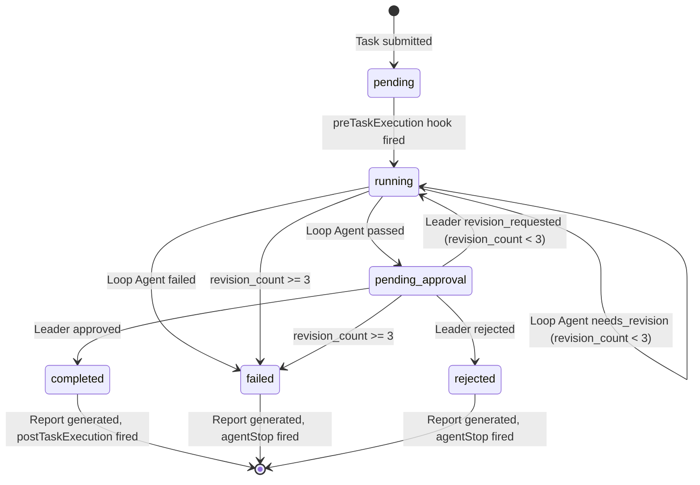
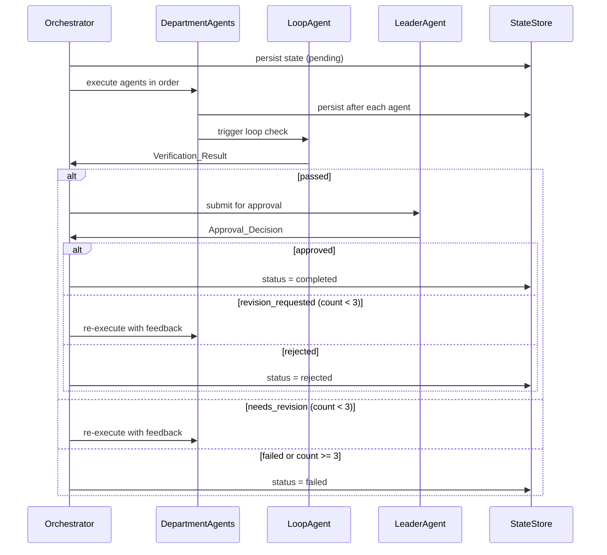

# Design Document: Department Multi-Agent Loop System

## Overview

Hệ thống **Department Multi-Agent Loop** là một orchestration engine chạy trong môi trường Next.js 15 + TypeScript, tích hợp với Kiro IDE Hook System. Hệ thống điều phối nhiều agent theo phòng ban, mỗi phòng ban có một tập agent chuyên biệt thực thi task theo thứ tự, một Loop Agent kiểm tra kết quả, và một Leader Agent duy nhất phê duyệt cuối cùng.

### Mục tiêu thiết kế

- **Correctness**: State machine rõ ràng, không có race condition giữa các task song song
- **Recoverability**: Persist state sau mỗi bước, resume được sau restart
- **Observability**: Hook events + query API cho phép monitor real-time
- **Configurability**: Toàn bộ cấu hình agent qua YAML, không cần code thay đổi

### Phạm vi

Hệ thống này là một **server-side module** trong Next.js app, expose:
- Next.js Route Handlers (`/api/tasks/*`) làm query interface
- CLI script (`scripts/agent-cli.ts`) cho terminal usage
- Hook integration với Kiro Hook System

---

## Architecture

### High-Level Architecture

```mermaid
graph TB
    subgraph Input
        CLI[CLI Interface]
        API[Next.js API Routes]
    end

    subgraph Core Engine
        ORCH[AgentOrchestrator]
        SM[State Machine]
        CTX[ExecutionContext Manager]
    end

    subgraph Agent Layer
        DA[DepartmentAgent Runner]
        LA[LoopAgent]
        LDA[LeaderAgent]
    end

    subgraph Persistence
        STATE[StateStore<br/>.kiro/state/{task_id}.json]
        REPORT[ReportGenerator<br/>.kiro/reports/{task_id}-{date}.md]
        CONFIG[ConfigLoader<br/>.kiro/agents/departments.yml]
    end

    subgraph Hooks
        HOOK[HookEmitter]
        PRE[preTaskExecution]
        POST[postTaskExecution]
        STOP[agentStop]
    end

    CLI --> ORCH
    API --> ORCH
    ORCH --> SM
    ORCH --> CTX
    SM --> DA
    SM --> LA
    SM --> LDA
    DA --> CTX
    LA --> CTX
    LDA --> CTX
    CTX --> STATE
    SM --> HOOK
    HOOK --> PRE
    HOOK --> POST
    HOOK --> STOP
    SM --> REPORT
    CONFIG --> ORCH
```

### State Machine



### Revision Cycle Flow



---

## Components and Interfaces

### 1. ConfigLoader

Đọc và validate file `.kiro/agents/departments.yml`.

```typescript
// lib/agents/config-loader.ts

export interface AgentConfigFile {
  leader: LeaderAgentConfig;
  departments: DepartmentConfig[];
  hooks?: HookConfig[];
}

export interface DepartmentConfig {
  department_id: string;          // kebab-case, unique
  display_name: string;
  description?: string;
  agents: AgentEntry[];
}

export interface AgentEntry {
  agent_id: string;               // unique within department
  role: 'executor' | 'reviewer' | 'specialist' | 'loop';
  prompt_template: string;        // path to .md or inline string
}

export interface LeaderAgentConfig {
  agent_id: string;
  role: 'leader';
  prompt_template: string;
}

export interface HookConfig {
  event: 'preTaskExecution' | 'postTaskExecution' | 'agentStop';
  handler: string;                // module path
  async?: boolean;
}

export interface ConfigLoader {
  load(workspaceRoot: string): Promise<AgentConfigFile>;
  validate(config: AgentConfigFile): ValidationResult;
}

export interface ValidationResult {
  valid: boolean;
  errors: string[];
}
```

### 2. AgentOrchestrator

Entry point chính, nhận task và điều phối toàn bộ flow.

```typescript
// lib/agents/orchestrator.ts

export interface TaskDefinition {
  task_id: string;
  department_id: string;
  title: string;
  description: string;
  goal: string;                   // Task_Goal cho Loop Agent verify
}

export interface AgentOrchestrator {
  submitTask(task: TaskDefinition): Promise<TaskResult>;
  getTaskStatus(task_id: string): Promise<TaskStatus | null>;
  resumeTask(task_id: string): Promise<TaskResult>;
}

export interface TaskResult {
  task_id: string;
  status: TaskStatus;
  report_file_path?: string;
  error?: string;
}

export type TaskStatus =
  | 'pending'
  | 'running'
  | 'pending_approval'
  | 'completed'
  | 'failed'
  | 'rejected';
```

### 3. ExecutionContext

Immutable-style context được persist sau mỗi bước.

```typescript
// lib/agents/execution-context.ts

export interface ExecutionContext {
  task_id: string;
  department_id: string;
  title: string;
  description: string;
  goal: string;
  status: TaskStatus;
  revision_count: number;         // tổng số revision cycles (max 3)
  started_at: string;             // ISO 8601
  completed_at?: string;
  agent_invocations: AgentInvocation[];
  verification_results: VerificationResult[];
  leader_decision?: ApprovalDecision;
  error?: string;
}

export interface AgentInvocation {
  agent_id: string;
  role: string;
  started_at: string;
  completed_at: string;
  output: string;
  revision_cycle: number;         // cycle index (0-based)
}

export interface VerificationResult {
  cycle_number: number;
  result: 'passed' | 'failed' | 'needs_revision';
  reason: string;
}

export interface ApprovalDecision {
  decision: 'approved' | 'rejected' | 'revision_requested';
  reason: string;
  revision_count_at_decision: number;
}
```

### 4. LoopAgent

Kiểm tra output của Department Agents so với Task_Goal.

```typescript
// lib/agents/loop-agent.ts

export interface LoopAgent {
  verify(context: ExecutionContext): Promise<VerificationResult>;
}
```

### 5. LeaderAgent

Phê duyệt cuối cùng, là singleton trong toàn hệ thống.

```typescript
// lib/agents/leader-agent.ts

export interface LeaderAgent {
  review(context: ExecutionContext): Promise<ApprovalDecision>;
}
```

### 6. StateStore

Persist và load ExecutionContext từ disk.

```typescript
// lib/agents/state-store.ts

export interface StateStore {
  save(context: ExecutionContext): Promise<void>;
  load(task_id: string): Promise<ExecutionContext | null>;
  list(): Promise<string[]>;      // list all task_ids
}
```

### 7. ReportGenerator

Sinh markdown report khi task đạt terminal status.

```typescript
// lib/agents/report-generator.ts

export interface ReportGenerator {
  generate(context: ExecutionContext): Promise<string>; // returns file path
}
```

### 8. HookEmitter

Emit Kiro Hook Events.

```typescript
// lib/agents/hook-emitter.ts

export interface HookEmitter {
  emit(event: HookEventType, payload: HookPayload): Promise<void>;
  register(event: HookEventType, handler: HookHandler, async?: boolean): void;
}

export type HookEventType = 'preTaskExecution' | 'postTaskExecution' | 'agentStop';

export interface HookPayload {
  task_id: string;
  department_id?: string;
  goal?: string;
  final_status?: TaskStatus;
  report_file_path?: string;
  agent_id?: string;
  error_message?: string;
}

export type HookHandler = (payload: HookPayload) => Promise<void>;
```

---

## Data Models

### File: `.kiro/agents/departments.yml`

```yaml
leader:
  agent_id: "leader-agent"
  role: leader
  prompt_template: ".kiro/agents/prompts/leader.md"

departments:
  - department_id: "engineering"
    display_name: "Engineering"
    description: "Software development and architecture"
    agents:
      - agent_id: "eng-architect"
        role: specialist
        prompt_template: ".kiro/agents/prompts/eng-architect.md"
      - agent_id: "eng-executor"
        role: executor
        prompt_template: ".kiro/agents/prompts/eng-executor.md"
      - agent_id: "eng-reviewer"
        role: reviewer
        prompt_template: ".kiro/agents/prompts/eng-reviewer.md"
      - agent_id: "eng-loop"
        role: loop
        prompt_template: ".kiro/agents/prompts/eng-loop.md"

  - department_id: "qa"
    display_name: "Quality Assurance"
    agents:
      - agent_id: "qa-tester"
        role: executor
        prompt_template: ".kiro/agents/prompts/qa-tester.md"
      - agent_id: "qa-loop"
        role: loop
        prompt_template: ".kiro/agents/prompts/qa-loop.md"

hooks:
  - event: postTaskExecution
    handler: "./lib/agents/hooks/notify-handler.ts"
    async: true
  - event: agentStop
    handler: "./lib/agents/hooks/error-handler.ts"
    async: false
```

### File: `.kiro/state/{task_id}.json`

```json
{
  "task_id": "task-2024-001",
  "department_id": "engineering",
  "title": "Implement user authentication",
  "description": "...",
  "goal": "User can login with email/password and receive JWT token",
  "status": "running",
  "revision_count": 1,
  "started_at": "2024-01-15T10:00:00.000Z",
  "completed_at": null,
  "agent_invocations": [
    {
      "agent_id": "eng-architect",
      "role": "specialist",
      "started_at": "2024-01-15T10:00:05.000Z",
      "completed_at": "2024-01-15T10:02:30.000Z",
      "output": "Architecture design: ...",
      "revision_cycle": 0
    }
  ],
  "verification_results": [
    {
      "cycle_number": 0,
      "result": "needs_revision",
      "reason": "Missing error handling for invalid credentials"
    }
  ],
  "leader_decision": null
}
```

### File: `.kiro/reports/{task_id}-{YYYY-MM-DD}.md`

```markdown
# Task Report: task-2024-001

## Task Summary
- **Task ID**: task-2024-001
- **Title**: Implement user authentication
- **Department**: engineering
- **Goal**: User can login with email/password and receive JWT token
- **Final Status**: completed
- **Started At**: 2024-01-15T10:00:00.000Z
- **Completed At**: 2024-01-15T10:45:00.000Z

## Department & Agents
- Department: Engineering
- Agents: eng-architect (specialist), eng-executor (executor), eng-reviewer (reviewer)
- Loop Agent: eng-loop

## Execution Timeline
| # | Agent | Role | Started | Completed | Output Summary |
|---|-------|------|---------|-----------|----------------|
| 1 | eng-architect | specialist | 10:00:05 | 10:02:30 | Architecture design: JWT-based auth... |

## Loop Verification Results
| Cycle | Result | Reason |
|-------|--------|--------|
| 0 | needs_revision | Missing error handling for invalid credentials |
| 1 | passed | All requirements met |

## Leader Decision
- **Decision**: approved
- **Reason**: Implementation is complete and well-tested
- **Revision Count at Decision**: 1

## Final Status
- **Status**: completed
- **Max Revisions Exceeded**: false
```

---

## Correctness Properties

*A property is a characteristic or behavior that should hold true across all valid executions of a system — essentially, a formal statement about what the system should do. Properties serve as the bridge between human-readable specifications and machine-verifiable correctness guarantees.*


### Property 1: Config validation produces descriptive errors

*For any* malformed or invalid YAML/JSON input passed to ConfigLoader, the validation result SHALL contain `valid: false` and an `errors` array with at least one non-empty string describing the file path and the specific failure reason.

**Validates: Requirements 1.2**

---

### Property 2: Exactly one Loop Agent per Department

*For any* department configuration, validation SHALL fail if and only if the number of agents with `role: loop` is not exactly 1. This holds for 0 loop agents, 2 loop agents, or any count other than 1.

**Validates: Requirements 1.5, 1.8**

---

### Property 3: Exactly one Leader Agent in config

*For any* Agent_Config, validation SHALL fail if and only if the number of entries with `role: leader` is not exactly 1. This holds whether there are 0 leaders or 2+ leaders.

**Validates: Requirements 1.6, 1.7**

---

### Property 4: Agent entry missing required fields always fails validation

*For any* agent entry that is missing one or more of `agent_id`, `role`, or `prompt_template`, the ConfigLoader SHALL return a validation error identifying the missing field(s) and the affected department.

**Validates: Requirements 1.4**

---

### Property 5: Non-existent prompt_template paths fail validation

*For any* Agent_Config referencing one or more `prompt_template` file paths that do not exist in the workspace, the ConfigLoader SHALL return a validation error listing all missing paths before any Task begins execution.

**Validates: Requirements 1.9**

---

### Property 6: Unknown department_id always fails task submission

*For any* TaskDefinition whose `department_id` does not match any department in the loaded Agent_Config, the AgentOrchestrator SHALL return an error and set the Task status to `failed` without executing any agent.

**Validates: Requirements 2.2, 2.3**

---

### Property 7: Agent execution order matches config order

*For any* Department with N agents (excluding the loop agent), the `agent_invocations` in ExecutionContext SHALL list those agents in the same order they appear in the Agent_Config, with each agent's `started_at` timestamp strictly after the previous agent's `completed_at` timestamp.

**Validates: Requirements 2.5**

---

### Property 8: Agent output always captured in context

*For any* agent invocation that completes (successfully or with error), the ExecutionContext SHALL contain an `AgentInvocation` entry for that agent with a non-null `output` field and valid ISO 8601 `started_at` and `completed_at` timestamps.

**Validates: Requirements 2.6, 7.6**

---

### Property 9: Execution context isolation between concurrent tasks

*For any* two Tasks running concurrently with different `task_id` values, the `agent_invocations`, `verification_results`, and `leader_decision` in each Task's ExecutionContext SHALL contain only entries belonging to that Task's own execution.

**Validates: Requirements 2.8**

---

### Property 10: Loop Agent always invoked after all Department Agents

*For any* Task execution, the Loop Agent's `started_at` timestamp in `agent_invocations` SHALL be strictly after the `completed_at` timestamp of every Department Agent invocation in the same revision cycle.

**Validates: Requirements 3.1**

---

### Property 11: Loop and Leader results always contain required fields

*For any* VerificationResult produced by a Loop Agent, the result SHALL have a `result` field with value in `{passed, failed, needs_revision}` and a non-empty `reason` string. *For any* ApprovalDecision produced by a Leader Agent, the decision SHALL have a `decision` field with value in `{approved, rejected, revision_requested}` and a non-empty `reason` string.

**Validates: Requirements 3.2, 3.7, 4.2, 4.6**

---

### Property 12: Revision count increments by exactly 1 per cycle

*For any* Task that undergoes N revision cycles (triggered by either Loop Agent `needs_revision` or Leader Agent `revision_requested`), the `revision_count` in ExecutionContext SHALL equal exactly N after those cycles complete.

**Validates: Requirements 3.8, 4.4**

---

### Property 13: Maximum 3 revision cycles enforced

*For any* Task where the Loop Agent or Leader Agent continuously requests revision, the system SHALL set the Task status to `failed` after exactly 3 revision cycles. The `revision_count` in ExecutionContext SHALL never exceed 3 for any Task.

**Validates: Requirements 3.6, 4.7**

---

### Property 14: pending_approval status locks context from modification

*For any* Task in `pending_approval` status, any attempt by a Department Agent or Loop Agent to append to or modify the ExecutionContext SHALL be rejected, and the Task status SHALL remain `pending_approval` until the Leader Agent produces a decision.

**Validates: Requirements 4.8**

---

### Property 15: Report generated for every terminal status

*For any* Task that reaches a terminal status (`completed`, `failed`, or `rejected`), a Report_File SHALL exist at `.kiro/reports/{task_id}-{YYYY-MM-DD}.md` (or with a numeric suffix if a collision exists) after the terminal transition completes.

**Validates: Requirements 5.1**

---

### Property 16: Report contains all required sections and fields

*For any* ExecutionContext in terminal status, the generated Report_File SHALL contain all six sections: Task Summary (with `task_id`, `title`, `department_id`, `goal`, `final_status`, `started_at`, `completed_at`), Department & Agents, Execution Timeline, Loop Verification Results, Leader Decision, and Final Status.

**Validates: Requirements 5.2, 5.3, 5.5, 5.6**

---

### Property 17: Report execution timeline is chronologically ordered

*For any* ExecutionContext with N agent invocations, the Execution Timeline section of the Report_File SHALL list those invocations in ascending order of `started_at` timestamp.

**Validates: Requirements 5.4**

---

### Property 18: max_revisions_exceeded flag set correctly

*For any* Task that fails because `revision_count` reached 3 without a `passed` or `approved` result, the Report_File Final Status section SHALL contain `max_revisions_exceeded: true`. *For any* Task that completes or fails for any other reason, this flag SHALL be `false` or absent.

**Validates: Requirements 5.7**

---

### Property 19: Report file written atomically

*For any* report generation process, the Report_File at the target path SHALL be either fully written (all required sections present) or absent. A partially-written file (truncated content, missing sections) SHALL never exist at the target path after the write operation completes or is interrupted.

**Validates: Requirements 5.8**

---

### Property 20: Report filename collision avoidance

*For any* N report generation calls for the same `task_id` on the same calendar date (N ≥ 2), all N resulting filenames SHALL be distinct. The first SHALL be `{task_id}-{date}.md`, the second `{task_id}-{date}-2.md`, and so on.

**Validates: Requirements 5.9**

---

### Property 21: Hook handler errors do not alter task status

*For any* Task in a terminal status where a registered `postTaskExecution` hook handler throws an error, the Task's status SHALL remain unchanged (not transition to a different status), and the error SHALL be logged without propagating to the caller.

**Validates: Requirements 6.4**

---

### Property 22: Multiple hook handlers execute in registration order

*For any* event type with N registered handlers, all N handlers SHALL be invoked, and their execution SHALL begin in the order they were registered (handler 1 before handler 2, etc.).

**Validates: Requirements 6.5**

---

### Property 23: Valid state machine transitions only

*For any* Task execution, the sequence of status values recorded in ExecutionContext SHALL be a valid path through the state machine: `pending` → `running` → (`pending_approval` →)? (`completed` | `failed` | `rejected`). No status SHALL appear after a terminal status, and no backward transitions SHALL occur.

**Validates: Requirements 7.1**

---

### Property 24: Query returns correct context for task_id

*For any* Task that has been submitted, querying the system with that Task's `task_id` SHALL return an ExecutionContext whose `task_id` field matches the query parameter and whose `status` reflects the most recently persisted state.

**Validates: Requirements 7.2**

---

### Property 25: State persisted after each agent completion

*For any* agent invocation that completes, the state file at `.kiro/state/{task_id}.json` SHALL be updated to include that agent's `AgentInvocation` entry before the next agent begins execution.

**Validates: Requirements 7.4**

---

### Property 26: State recovery resumes from last completed step

*For any* incomplete ExecutionContext loaded from disk (where `status` is `running` and N agents have completed), resuming the Task SHALL begin execution from agent index N (the first agent not yet completed in the current revision cycle), not from agent index 0.

**Validates: Requirements 7.5**

---

### Property 27: preTaskExecution hook fired before first agent invocation

*For any* Task execution, the `preTaskExecution` Hook_Event SHALL be emitted before the `started_at` timestamp of the first Department Agent invocation in the ExecutionContext.

**Validates: Requirements 2.4, 6.1**

---


---

## Error Handling

### Config Errors (startup-time)

| Lỗi | Hành vi |
|-----|---------|
| File không tồn tại | Throw `ConfigNotFoundError` với path, halt initialization |
| YAML/JSON malformed | Throw `ConfigParseError` với line/column info |
| Thiếu leader agent | Throw `ConfigValidationError: "Exactly one leader required"` |
| Department thiếu loop agent | Throw `ConfigValidationError: "Department {id} missing loop agent"` |
| prompt_template path không tồn tại | Throw `ConfigValidationError: "Missing prompt file: {path}"` |
| Duplicate agent_id trong department | Throw `ConfigValidationError: "Duplicate agent_id: {id}"` |

### Runtime Errors (task execution)

| Lỗi | Hành vi |
|-----|---------|
| Department agent unhandled exception | Emit `agentStop`, record error in context, halt agent sequence, set status `failed` |
| Loop agent exception | Emit `agentStop`, set status `failed`, generate report |
| Leader agent exception | Emit `agentStop`, set status `failed`, generate report |
| Max revision cycles exceeded | Set status `failed`, generate report với `max_revisions_exceeded: true` |
| State file write failure | Log error, retry once, nếu vẫn fail thì log critical và continue (không halt task) |
| Report file write failure | Log error, retry với temp file + atomic rename |
| Hook handler exception | Log error, continue execution, không thay đổi task status |

### Concurrency Errors

- Mỗi task có isolated ExecutionContext, không share state
- `pending_approval` status dùng optimistic locking: bất kỳ write nào vào context khi status là `pending_approval` sẽ bị reject với `ContextLockedError`
- State file writes dùng atomic rename pattern: write to `{task_id}.json.tmp` rồi rename

### Error Recovery

```typescript
// Atomic write pattern cho state persistence
async function atomicWrite(filePath: string, content: string): Promise<void> {
  const tmpPath = `${filePath}.tmp`;
  await fs.writeFile(tmpPath, content, 'utf-8');
  await fs.rename(tmpPath, filePath); // atomic on POSIX systems
}
```

---

## Testing Strategy

### Dual Testing Approach

Hệ thống này có nhiều pure functions (config validation, state transitions, report generation) phù hợp với property-based testing, kết hợp với example-based tests cho integration points.

### Property-Based Testing

**Library**: `fast-check` (TypeScript-native, excellent arbitrary generators)

**Configuration**: Minimum 100 iterations per property test.

**Tag format**: `// Feature: department-multi-agent-loop, Property {N}: {property_text}`

Mỗi Correctness Property ở trên được implement bằng một property-based test:

```typescript
// Ví dụ: Property 13 - Max 3 revision cycles
import fc from 'fast-check';

test('Property 13: revision_count never exceeds 3', () => {
  // Feature: department-multi-agent-loop, Property 13: Max 3 revision cycles enforced
  fc.assert(
    fc.property(
      fc.record({
        task_id: fc.uuid(),
        department_id: fc.constantFrom('engineering', 'qa'),
        title: fc.string({ minLength: 1 }),
        description: fc.string(),
        goal: fc.string({ minLength: 1 }),
      }),
      async (taskDef) => {
        const alwaysNeedsRevision = createMockLoopAgent('needs_revision');
        const orchestrator = createOrchestrator({ loopAgent: alwaysNeedsRevision });
        const result = await orchestrator.submitTask(taskDef);
        
        expect(result.status).toBe('failed');
        const ctx = await orchestrator.getTaskStatus(taskDef.task_id);
        expect(ctx!.revision_count).toBeLessThanOrEqual(3);
      }
    ),
    { numRuns: 100 }
  );
});
```

**Properties được cover bởi PBT** (Properties 1–27 ở trên):
- P1, P2, P3, P4, P5: Config validation properties
- P6: Task submission validation
- P7, P8, P9, P10: Execution ordering và isolation
- P11, P12, P13: Loop/Leader result correctness và revision limits
- P14: Context locking
- P15, P16, P17, P18, P19, P20: Report generation correctness
- P21, P22: Hook system behavior
- P23, P24, P25, P26, P27: State machine và persistence

### Unit Tests (Example-Based)

Tập trung vào:
- Specific state transitions (e.g., `approved` → `completed` + `postTaskExecution`)
- Error paths (e.g., agent exception → `agentStop` fired)
- Async hook handler không block main loop
- `not_found` error khi query unknown `task_id`
- CLI output format

### Integration Tests

Tập trung vào:
- End-to-end task execution với mock agents
- State file read/write trên real filesystem
- Report file generation và atomic write
- Hook handler registration và execution
- Resume từ persisted state sau simulated restart

### Test File Structure

```
lib/agents/__tests__/
  config-loader.property.test.ts    # P1-P5
  orchestrator.property.test.ts     # P6-P14, P23, P27
  report-generator.property.test.ts # P15-P20
  hook-emitter.property.test.ts     # P21-P22
  state-store.property.test.ts      # P24-P26
  orchestrator.unit.test.ts         # Example-based unit tests
  integration/
    full-flow.test.ts               # End-to-end integration tests
```

### Test Runner

```bash
# Single run (CI)
npx jest --testPathPattern="agents" --runInBand

# Property tests với verbose output
npx jest --testPathPattern="property" --verbose
```
