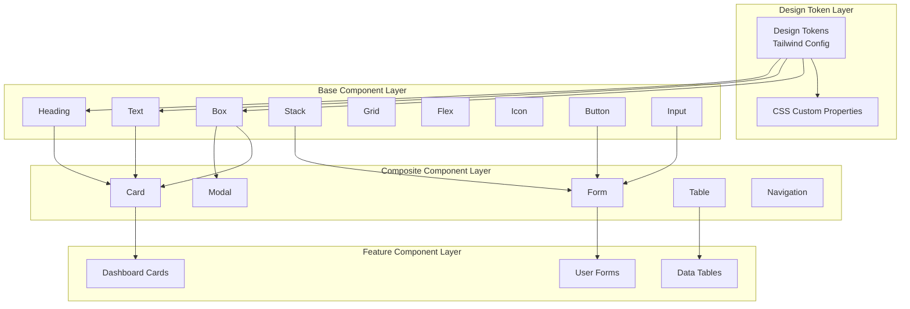

# Design Document: Design System Standardization

## Overview

This design document outlines the comprehensive technical architecture for standardizing the MindX design system. The system follows a **composition-first approach** where complex components are built by composing primitive base components, ensuring consistency, maintainability, and reusability across the entire application.

### Core Principles

1. **Composition over Duplication**: All complex components must be built by composing base/primitive components
2. **Single Source of Truth**: Design tokens centralized in Tailwind configuration
3. **Type Safety**: Full TypeScript support with strict typing for composition patterns
4. **Accessibility First**: WCAG 2.1 Level AA compliance by default
5. **Vietnamese Language First**: All user-facing content in Vietnamese with proper diacritics
6. **Mathematical Consistency**: Typography scale based on 1.250 (Major Third) ratio

### Technology Stack

- **Framework**: Next.js 16 with React 19
- **Styling**: Tailwind CSS 4 with CSS custom properties
- **Component Library**: shadcn/ui as base (to be standardized)
- **Icons**: lucide-react
- **Type System**: TypeScript 5
- **Composition Utilities**: Radix UI primitives (@radix-ui/react-slot)
- **Variant Management**: class-variance-authority (CVA)

## Architecture

### System Architecture Diagram



### Component Hierarchy

The design system follows a strict three-layer hierarchy:

1. **Primitive Layer**: Unstyled or minimally styled base components (Box, Text, Heading, Stack, Grid, Flex, Icon)
2. **Component Layer**: Styled, reusable UI components built from primitives (Button, Input, Card, Modal)
3. **Pattern Layer**: Feature-specific compositions of components (LoginForm, DashboardCard, DataTable)

### Composition Patterns

#### 1. Compound Components

Components that work together as a cohesive unit:

```typescript
<Card>
  <CardHeader>
    <CardTitle>Tiêu đề</CardTitle>
    <CardDescription>Mô tả</CardDescription>
  </CardHeader>
  <CardContent>Nội dung</CardContent>
  <CardFooter>Chân trang</CardFooter>
</Card>
```

#### 2. Polymorphic Components

Components that can render as different HTML elements:

```typescript
<Button asChild>
  <a href="/link">Liên kết</a>
</Button>
```

#### 3. Slot-based Composition

Using data-slot attributes for flexible styling:

```typescript
<div data-slot="container">
  <div data-slot="header">...</div>
  <div data-slot="content">...</div>
</div>
```

## Components and Interfaces

### Base Component Library

#### Box Component

The most primitive layout component. All other components should compose from Box.

```typescript
// components/ui/primitives/box.tsx
import * as React from 'react'
import { Slot } from '@radix-ui/react-slot'
import { cn } from '@/lib/utils'

interface BoxProps extends React.ComponentProps<'div'> {
  asChild?: boolean
}

export function Box({ asChild = false, className, ...props }: BoxProps) {
  const Comp = asChild ? Slot : 'div'
  return <Comp className={cn(className)} {...props} />
}
```

**Usage**:
- Base for all container components
- Accepts all standard div props
- Supports polymorphic rendering via `asChild`

#### Text Component

Primitive text component with consistent typography.

```typescript
// components/ui/primitives/text.tsx
import * as React from 'react'
import { Slot } from '@radix-ui/react-slot'
import { cva, type VariantProps } from 'class-variance-authority'
import { cn } from '@/lib/utils'

const textVariants = cva('', {
  variants: {
    size: {
      xs: 'text-xs',      // 10.24px (16 / 1.25^2)
      sm: 'text-sm',      // 12.8px (16 / 1.25)
      base: 'text-base',  // 16px
      lg: 'text-lg',      // 20px (16 * 1.25)
      xl: 'text-xl',      // 25px (16 * 1.25^2)
    },
    weight: {
      light: 'font-light',
      normal: 'font-normal',
      medium: 'font-medium',
      semibold: 'font-semibold',
      bold: 'font-bold',
    },
    color: {
      primary: 'text-foreground',
      secondary: 'text-muted-foreground',
      muted: 'text-muted-foreground/60',
      disabled: 'text-muted-foreground/40',
      error: 'text-destructive',
      success: 'text-green-600',
      warning: 'text-yellow-600',
      info: 'text-blue-600',
    },
  },
  defaultVariants: {
    size: 'base',
    weight: 'normal',
    color: 'primary',
  },
})

interface TextProps
  extends React.ComponentProps<'span'>,
    VariantProps<typeof textVariants> {
  asChild?: boolean
}

export function Text({
  asChild = false,
  size,
  weight,
  color,
  className,
  ...props
}: TextProps) {
  const Comp = asChild ? Slot : 'span'
  return (
    <Comp
      className={cn(textVariants({ size, weight, color }), className)}
      {...props}
    />
  )
}
```

#### Heading Component

Semantic heading component following 1.250 typography scale.

```typescript
// components/ui/primitives/heading.tsx
import * as React from 'react'
import { Slot } from '@radix-ui/react-slot'
import { cva, type VariantProps } from 'class-variance-authority'
import { cn } from '@/lib/utils'

const headingVariants = cva('font-bold', {
  variants: {
    level: {
      h1: 'text-5xl',  // 61.04px (16 * 1.25^5)
      h2: 'text-4xl',  // 48.83px (16 * 1.25^4)
      h3: 'text-3xl',  // 39.06px (16 * 1.25^3)
      h4: 'text-2xl',  // 31.25px (16 * 1.25^2)
      h5: 'text-xl',   // 25px (16 * 1.25)
      h6: 'text-lg',   // 20px (16 * 1.25)
    },
  },
  defaultVariants: {
    level: 'h2',
  },
})

interface HeadingProps
  extends Omit<React.ComponentProps<'h2'>, 'ref'>,
    VariantProps<typeof headingVariants> {
  asChild?: boolean
}

export function Heading({
  asChild = false,
  level = 'h2',
  className,
  ...props
}: HeadingProps) {
  const Comp = asChild ? Slot : level || 'h2'
  return (
    <Comp
      className={cn(headingVariants({ level }), className)}
      {...props}
    />
  )
}
```

#### Stack Component

Vertical layout primitive with consistent spacing.

```typescript
// components/ui/primitives/stack.tsx
import * as React from 'react'
import { cva, type VariantProps } from 'class-variance-authority'
import { cn } from '@/lib/utils'

const stackVariants = cva('flex flex-col', {
  variants: {
    gap: {
      none: 'gap-0',
      xs: 'gap-1',    // 4px
      sm: 'gap-2',    // 8px
      md: 'gap-4',    // 16px
      lg: 'gap-6',    // 24px
      xl: 'gap-8',    // 32px
    },
    align: {
      start: 'items-start',
      center: 'items-center',
      end: 'items-end',
      stretch: 'items-stretch',
    },
  },
  defaultVariants: {
    gap: 'md',
    align: 'stretch',
  },
})

interface StackProps
  extends React.ComponentProps<'div'>,
    VariantProps<typeof stackVariants> {}

export function Stack({ gap, align, className, ...props }: StackProps) {
  return (
    <div
      className={cn(stackVariants({ gap, align }), className)}
      {...props}
    />
  )
}
```

#### Flex Component

Horizontal layout primitive with consistent spacing.

```typescript
// components/ui/primitives/flex.tsx
import * as React from 'react'
import { cva, type VariantProps } from 'class-variance-authority'
import { cn } from '@/lib/utils'

const flexVariants = cva('flex', {
  variants: {
    gap: {
      none: 'gap-0',
      xs: 'gap-1',
      sm: 'gap-2',
      md: 'gap-4',
      lg: 'gap-6',
      xl: 'gap-8',
    },
    align: {
      start: 'items-start',
      center: 'items-center',
      end: 'items-end',
      stretch: 'items-stretch',
      baseline: 'items-baseline',
    },
    justify: {
      start: 'justify-start',
      center: 'justify-center',
      end: 'justify-end',
      between: 'justify-between',
      around: 'justify-around',
      evenly: 'justify-evenly',
    },
    wrap: {
      nowrap: 'flex-nowrap',
      wrap: 'flex-wrap',
      'wrap-reverse': 'flex-wrap-reverse',
    },
  },
  defaultVariants: {
    gap: 'md',
    align: 'center',
    justify: 'start',
    wrap: 'nowrap',
  },
})

interface FlexProps
  extends React.ComponentProps<'div'>,
    VariantProps<typeof flexVariants> {}

export function Flex({
  gap,
  align,
  justify,
  wrap,
  className,
  ...props
}: FlexProps) {
  return (
    <div
      className={cn(flexVariants({ gap, align, justify, wrap }), className)}
      {...props}
    />
  )
}
```

#### Grid Component

Grid layout primitive with responsive columns.

```typescript
// components/ui/primitives/grid.tsx
import * as React from 'react'
import { cva, type VariantProps } from 'class-variance-authority'
import { cn } from '@/lib/utils'

const gridVariants = cva('grid', {
  variants: {
    cols: {
      1: 'grid-cols-1',
      2: 'grid-cols-2',
      3: 'grid-cols-3',
      4: 'grid-cols-4',
      6: 'grid-cols-6',
      12: 'grid-cols-12',
    },
    gap: {
      none: 'gap-0',
      xs: 'gap-1',
      sm: 'gap-2',
      md: 'gap-4',
      lg: 'gap-6',
      xl: 'gap-8',
    },
  },
  defaultVariants: {
    cols: 1,
    gap: 'md',
  },
})

interface GridProps
  extends React.ComponentProps<'div'>,
    VariantProps<typeof gridVariants> {}

export function Grid({ cols, gap, className, ...props }: GridProps) {
  return (
    <div className={cn(gridVariants({ cols, gap }), className)} {...props} />
  )
}
```

#### Icon Component

Wrapper for lucide-react icons with consistent sizing.

```typescript
// components/ui/primitives/icon.tsx
import * as React from 'react'
import { cva, type VariantProps } from 'class-variance-authority'
import { cn } from '@/lib/utils'
import { LucideIcon } from 'lucide-react'

const iconVariants = cva('shrink-0', {
  variants: {
    size: {
      xs: 'size-3',   // 12px
      sm: 'size-4',   // 16px
      md: 'size-5',   // 20px
      lg: 'size-6',   // 24px
      xl: 'size-8',   // 32px
      '2xl': 'size-12', // 48px
    },
  },
  defaultVariants: {
    size: 'md',
  },
})

interface IconProps extends VariantProps<typeof iconVariants> {
  icon: LucideIcon
  className?: string
  'aria-label'?: string
}

export function Icon({
  icon: IconComponent,
  size,
  className,
  'aria-label': ariaLabel,
  ...props
}: IconProps) {
  return (
    <IconComponent
      className={cn(iconVariants({ size }), className)}
      aria-label={ariaLabel}
      aria-hidden={!ariaLabel}
      {...props}
    />
  )
}
```

### Composite Components

#### Button Component (Refactored)

Built from Box and Text primitives with consistent patterns.

```typescript
// components/ui/button.tsx
import * as React from 'react'
import { Slot } from '@radix-ui/react-slot'
import { cva, type VariantProps } from 'class-variance-authority'
import { cn } from '@/lib/utils'

const buttonVariants = cva(
  'inline-flex items-center justify-center gap-2 whitespace-nowrap rounded-md font-medium transition-all cursor-pointer disabled:pointer-events-none disabled:opacity-50 disabled:cursor-not-allowed outline-none focus-visible:ring-2 focus-visible:ring-ring focus-visible:ring-offset-2',
  {
    variants: {
      variant: {
        default: 'bg-primary text-primary-foreground hover:bg-primary/90',
        destructive: 'bg-red-600 text-white hover:bg-red-700',
        outline: 'border border-input bg-background hover:bg-accent hover:text-accent-foreground',
        secondary: 'bg-secondary text-secondary-foreground hover:bg-secondary/80',
        ghost: 'hover:bg-accent hover:text-accent-foreground',
        link: 'text-primary underline-offset-4 hover:underline',
        success: 'bg-green-600 text-white hover:bg-green-700',
        mindx: 'bg-gradient-to-r from-[#a1001f] to-[#c41230] text-white hover:from-[#8a0019] hover:to-[#a1001f] shadow-md hover:shadow-lg',
      },
      size: {
        xs: 'h-7 px-2 text-xs',
        sm: 'h-8 px-3 text-sm',
        default: 'h-9 px-4 text-sm',
        lg: 'h-10 px-6 text-base',
        icon: 'size-9',
        'icon-sm': 'size-8',
        'icon-lg': 'size-10',
      },
    },
    defaultVariants: {
      variant: 'default',
      size: 'default',
    },
  }
)

interface ButtonProps
  extends React.ComponentProps<'button'>,
    VariantProps<typeof buttonVariants> {
  asChild?: boolean
  loading?: boolean
}

export function Button({
  className,
  variant,
  size,
  asChild = false,
  loading = false,
  children,
  disabled,
  ...props
}: ButtonProps) {
  const Comp = asChild ? Slot : 'button'

  return (
    <Comp
      className={cn(buttonVariants({ variant, size, className }))}
      disabled={disabled || loading}
      {...props}
    >
      {loading && (
        <svg
          className="animate-spin size-4"
          xmlns="http://www.w3.org/2000/svg"
          fill="none"
          viewBox="0 0 24 24"
        >
          <circle
            className="opacity-25"
            cx="12"
            cy="12"
            r="10"
            stroke="currentColor"
            strokeWidth="4"
          />
          <path
            className="opacity-75"
            fill="currentColor"
            d="M4 12a8 8 0 018-8V0C5.373 0 0 5.373 0 12h4zm2 5.291A7.962 7.962 0 014 12H0c0 3.042 1.135 5.824 3 7.938l3-2.647z"
          />
        </svg>
      )}
      {children}
    </Comp>
  )
}
```

#### Card Component (Refactored)

Built from Box, Stack, and Text primitives.

```typescript
// components/ui/card.tsx
import * as React from 'react'
import { cn } from '@/lib/utils'
import { Box } from './primitives/box'
import { Stack } from './primitives/stack'

interface CardProps extends React.ComponentProps<'div'> {
  variant?: 'default' | 'outlined' | 'elevated' | 'interactive'
  padding?: 'sm' | 'md' | 'lg'
}

export function Card({
  variant = 'default',
  padding = 'md',
  className,
  ...props
}: CardProps) {
  return (
    <Box
      className={cn(
        'rounded-xl border bg-card text-card-foreground shadow-sm',
        {
          'border-border': variant === 'default',
          'border-2 border-border': variant === 'outlined',
          'shadow-lg': variant === 'elevated',
          'hover:shadow-md transition-shadow cursor-pointer': variant === 'interactive',
          'p-4': padding === 'sm',
          'p-6': padding === 'md',
          'p-8': padding === 'lg',
        },
        className
      )}
      {...props}
    />
  )
}

export function CardHeader({
  className,
  ...props
}: React.ComponentProps<'div'>) {
  return (
    <Stack
      gap="sm"
      className={cn('pb-4', className)}
      {...props}
    />
  )
}

export function CardTitle({
  className,
  ...props
}: React.ComponentProps<'h3'>) {
  return (
    <h3
      className={cn('text-xl font-semibold leading-none', className)}
      {...props}
    />
  )
}

export function CardDescription({
  className,
  ...props
}: React.ComponentProps<'p'>) {
  return (
    <p
      className={cn('text-sm text-muted-foreground', className)}
      {...props}
    />
  )
}

export function CardContent({
  className,
  ...props
}: React.ComponentProps<'div'>) {
  return <Box className={cn('', className)} {...props} />
}

export function CardFooter({
  className,
  ...props
}: React.ComponentProps<'div'>) {
  return (
    <Box
      className={cn('flex items-center pt-4', className)}
      {...props}
    />
  )
}
```

#### Form Components

Built from base Input primitive with consistent patterns.

```typescript
// components/ui/form-field.tsx
import * as React from 'react'
import { cn } from '@/lib/utils'
import { Stack } from './primitives/stack'
import { Text } from './primitives/text'
import { Input } from './input'

interface FormFieldProps {
  label: string
  error?: string
  helperText?: string
  required?: boolean
  children: React.ReactNode
  className?: string
}

export function FormField({
  label,
  error,
  helperText,
  required,
  children,
  className,
}: FormFieldProps) {
  return (
    <Stack gap="xs" className={className}>
      <label className="flex items-center gap-1 text-sm font-medium">
        {label}
        {required && (
          <span className="text-red-500 text-base ml-1" aria-label="bắt buộc">
            *
          </span>
        )}
      </label>
      {children}
      {error && (
        <Text size="sm" color="error" className="flex items-center gap-1">
          <svg
            className="size-4"
            fill="none"
            viewBox="0 0 24 24"
            stroke="currentColor"
          >
            <path
              strokeLinecap="round"
              strokeLinejoin="round"
              strokeWidth={2}
              d="M12 8v4m0 4h.01M21 12a9 9 0 11-18 0 9 9 0 0118 0z"
            />
          </svg>
          {error}
        </Text>
      )}
      {helperText && !error && (
        <Text size="sm" color="secondary">
          {helperText}
        </Text>
      )}
    </Stack>
  )
}
```

## Data Models

### Design Token Structure

```typescript
// types/design-tokens.ts

export interface DesignTokens {
  colors: ColorTokens
  spacing: SpacingTokens
  typography: TypographyTokens
  borderRadius: BorderRadiusTokens
  shadows: ShadowTokens
  zIndex: ZIndexTokens
  animation: AnimationTokens
}

export interface ColorTokens {
  // Brand colors
  brand: {
    primary: string      // #a1001f
    primaryDark: string  // #8a0019
    primaryLight: string // #c41230
  }
  
  // Neutral colors (10 shades)
  neutral: {
    50: string
    100: string
    200: string
    300: string
    400: string
    500: string
    600: string
    700: string
    800: string
    900: string
    950: string
  }
  
  // Semantic colors
  semantic: {
    success: string
    error: string
    warning: string
    info: string
  }
  
  // UI colors
  ui: {
    background: string
    foreground: string
    card: string
    cardForeground: string
    popover: string
    popoverForeground: string
    primary: string
    primaryForeground: string
    secondary: string
    secondaryForeground: string
    muted: string
    mutedForeground: string
    accent: string
    accentForeground: string
    destructive: string
    destructiveForeground: string
    border: string
    input: string
    ring: string
  }
}

export interface SpacingTokens {
  0: string    // 0px
  1: string    // 4px
  2: string    // 8px
  3: string    // 12px
  4: string    // 16px
  5: string    // 20px
  6: string    // 24px
  8: string    // 32px
  10: string   // 40px
  12: string   // 48px
  16: string   // 64px
  20: string   // 80px
  24: string   // 96px
  32: string   // 128px
}

export interface TypographyTokens {
  // Font sizes following 1.250 scale
  fontSize: {
    xs: string    // 10.24px
    sm: string    // 12.8px
    base: string  // 16px
    lg: string    // 20px
    xl: string    // 25px
    '2xl': string // 31.25px
    '3xl': string // 39.06px
    '4xl': string // 48.83px
    '5xl': string // 61.04px
    '6xl': string // 76.29px
  }
  
  fontWeight: {
    light: number    // 300
    normal: number   // 400
    medium: number   // 500
    semibold: number // 600
    bold: number     // 700
  }
  
  lineHeight: {
    tight: number   // 1.25
    normal: number  // 1.5
    relaxed: number // 1.75
    loose: number   // 2
  }
  
  fontFamily: {
    sans: string[]
    mono: string[]
  }
}

export interface BorderRadiusTokens {
  none: string  // 0
  sm: string    // 4px
  md: string    // 6px
  lg: string    // 8px
  xl: string    // 12px
  '2xl': string // 16px
  full: string  // 9999px
}

export interface ShadowTokens {
  xs: string
  sm: string
  md: string
  lg: string
  xl: string
  '2xl': string
}

export interface ZIndexTokens {
  base: number          // 0
  dropdown: number      // 1000
  sticky: number        // 1100
  fixed: number         // 1200
  modalBackdrop: number // 1300
  modal: number         // 1400
  popover: number       // 1500
  tooltip: number       // 1600
}

export interface AnimationTokens {
  duration: {
    fast: string    // 150ms
    normal: string  // 300ms
    slow: string    // 500ms
  }
  
  easing: {
    easeIn: string
    easeOut: string
    easeInOut: string
    linear: string
  }
}
```

### Component Prop Patterns

```typescript
// types/component-patterns.ts

// Base component props
export interface BaseComponentProps {
  className?: string
  children?: React.ReactNode
}

// Polymorphic component props
export interface PolymorphicProps {
  asChild?: boolean
}

// Variant props
export interface VariantProps {
  variant?: string
  size?: string
}

// State props
export interface StateProps {
  disabled?: boolean
  loading?: boolean
  error?: boolean
}

// Composition props
export interface CompositionProps extends BaseComponentProps, PolymorphicProps {}
```

### Vietnamese Language Data Model

```typescript
// types/vietnamese-language.ts

export interface VietnameseUIGlossary {
  buttons: Record<string, string>
  formFields: Record<string, string>
  validation: Record<string, string>
  status: Record<string, string>
  navigation: Record<string, string>
  time: Record<string, string>
  emptyStates: Record<string, string>
  commonPhrases: Record<string, string>
}

export const vietnameseGlossary: VietnameseUIGlossary = {
  buttons: {
    submit: 'Gửi',
    save: 'Lưu',
    delete: 'Xóa',
    cancel: 'Hủy',
    edit: 'Chỉnh sửa',
    add: 'Thêm',
    remove: 'Xóa bỏ',
    update: 'Cập nhật',
    create: 'Tạo',
    close: 'Đóng',
    // ... more translations
  },
  formFields: {
    email: 'Địa chỉ email',
    password: 'Mật khẩu',
    username: 'Tên đăng nhập',
    fullName: 'Họ và tên',
    phoneNumber: 'Số điện thoại',
    address: 'Địa chỉ',
    // ... more translations
  },
  // ... other categories
}
```

## Correctness Properties

*A property is a characteristic or behavior that should hold true across all valid executions of a system—essentially, a formal statement about what the system should do. Properties serve as the bridge between human-readable specifications and machine-verifiable correctness guarantees.*

### Property-Based Testing Applicability

This design system standardization feature is **partially suitable** for property-based testing. While infrastructure configuration (Tailwind config, CSS setup) and UI rendering are not suitable for PBT, the following areas ARE suitable:

1. **Component composition logic**: Verifying that composed components maintain correct prop types and behavior
2. **Design token calculations**: Verifying typography scale calculations follow 1.250 ratio
3. **Vietnamese language validation**: Verifying diacritic presence and content rules
4. **Component reusability metrics**: Verifying dependency graphs and composition patterns

For areas not suitable for PBT (Tailwind config, CSS output, visual rendering), we will use:
- **Snapshot tests** for generated CSS and configuration
- **Visual regression tests** for component rendering
- **Integration tests** for theme switching and responsive behavior
- **Linting rules** for enforcing standards

### Testable Properties


Based on the prework analysis, the following properties are suitable for property-based testing:

### Property 1: Typography Scale Mathematical Consistency

*For any* font size defined in the design system, it SHALL equal the base size (16px) multiplied by 1.25 raised to some integer power, within floating-point tolerance (±0.1px).

**Validates: Requirements 1.3, 4.2, 4.3, 4.13**

**Rationale**: The 1.250 (Major Third) ratio is a mathematical invariant that must hold for ALL font sizes. This ensures visual harmony and predictable scaling. Property-based testing can generate random font size values and verify they conform to the formula: `fontSize = 16 * (1.25^n)` where n is an integer.

**Test Strategy**: Extract all font-size values from Tailwind configuration and generated CSS, verify each value can be expressed as 16 * 1.25^n for some integer n.

### Property 2: Color Contrast Accessibility Compliance

*For any* foreground and background color combination used in the design system, the contrast ratio SHALL meet or exceed WCAG 2.1 Level AA standards (4.5:1 for normal text, 3:1 for large text).

**Validates: Requirements 2.4, 2.9**

**Rationale**: Accessibility is non-negotiable. Every color combination must be tested, not just a few examples. Property-based testing can generate all possible foreground/background pairs from our palette and verify contrast ratios.

**Test Strategy**: Generate all combinations of text colors and background colors from the design token palette, calculate contrast ratios using WCAG formula, verify compliance.

### Property 3: Component Composition Dependency Graph

*For any* non-primitive component in the design system, it SHALL be built by composing at least one primitive base component (Box, Text, Heading, Stack, Grid, Flex, Icon, Button, Input).

**Validates: Requirements 6.2, 21.1**

**Rationale**: This enforces the composition-first architecture. Every complex component must trace back to base components. Property-based testing can analyze the component dependency graph and verify no component is built in isolation.

**Test Strategy**: Parse all component source files, build import dependency graph, verify each non-primitive component imports and uses at least one primitive component.

### Property 4: Vietnamese Content Enforcement

*For any* user-facing text string in UI components, it SHALL be either valid Vietnamese text (containing Vietnamese characters with proper diacritics) OR an approved technical term from the whitelist.

**Validates: Requirements 14.1, 26.1, 26.3**

**Rationale**: All user-facing content must be in Vietnamese with correct diacritics. Property-based testing can scan all UI text and verify it meets Vietnamese language rules.

**Test Strategy**: Extract all text content from components (button labels, form labels, messages, tooltips), verify each string either contains Vietnamese diacritics OR matches an entry in the technical term whitelist (API, URL, email, etc.).

### Property 5: Vietnamese Diacritic Completeness

*For any* Vietnamese text string in the UI, all required diacritic marks SHALL be present (no bare vowels in Vietnamese words).

**Validates: Requirements 26.3, 26.13**

**Rationale**: Vietnamese text without diacritics is incorrect and unprofessional. Property-based testing can detect missing diacritics by checking for Vietnamese words with bare vowels.

**Test Strategy**: Extract all Vietnamese text, tokenize into words, verify each word either has proper diacritics OR is a technical term OR is a number/punctuation.

### Property 6: Button Order in Forms

*For any* form or modal containing exactly 2 buttons, the cancel/secondary button SHALL appear before (to the left of) the submit/primary button in DOM order.

**Validates: Requirements 7.6, 7.7**

**Rationale**: Consistent button ordering improves usability. Users expect cancel on the left, submit on the right. Property-based testing can find all forms with 2 buttons and verify order.

**Test Strategy**: Parse all form and modal components, find instances with exactly 2 buttons, verify the first button has cancel/secondary variant and second has submit/primary variant.

### Property 7: Icon Placement Consistency

*For any* component containing both an icon and text, the icon SHALL be positioned before (to the left of) the text in DOM order, UNLESS the icon is a directional indicator (arrow, chevron, external link).

**Validates: Requirements 13.1, 13.2**

**Rationale**: Consistent icon placement creates visual harmony. Property-based testing can verify this pattern across all components.

**Test Strategy**: Parse all components with icons and text, verify icon element comes before text element in DOM order (excluding directional icons like ArrowRight, ChevronRight, ExternalLink).

### Property 8: Required Field Indicator Placement

*For any* form field marked as required, the asterisk (*) indicator SHALL be positioned after the label text with exactly 4px left margin and red color (#ef4444).

**Validates: Requirements 13.9, 13.10**

**Rationale**: Consistent required field indicators improve form usability. Property-based testing can verify placement and styling.

**Test Strategy**: Find all form fields with required prop, verify asterisk element exists after label with margin-left: 4px (or ml-1 in Tailwind) and text-red-500 class.

### Property 9: Timestamp Formatting Consistency

*For any* timestamp value, if it represents an event within the last 24 hours, it SHALL be formatted as relative time in Vietnamese (e.g., "2 phút trước", "1 giờ trước"), otherwise as absolute date (e.g., "15/01/2024").

**Validates: Requirements 13.19**

**Rationale**: Consistent timestamp formatting improves user experience. Property-based testing can generate random timestamps and verify formatting.

**Test Strategy**: Generate random timestamps (recent and old), pass to formatting function, verify output matches expected pattern based on age.

### Property 10: Number Formatting Consistency

*For any* numeric value displayed in the UI, it SHALL be formatted with consistent thousand separators (either period "1.234.567" or comma "1,234,567") throughout the entire application.

**Validates: Requirements 13.20**

**Rationale**: Mixing number formats is confusing. Property-based testing can verify all numbers use the same format.

**Test Strategy**: Extract all number formatting calls, verify they all use the same separator pattern (all periods OR all commas, not mixed).

### Property 11: Currency Formatting Consistency

*For any* currency value in VND, it SHALL be formatted with the "₫" symbol after the number, with no decimal places, and using consistent thousand separators.

**Validates: Requirements 13.21**

**Rationale**: Currency formatting must be consistent for financial clarity. Property-based testing can generate random currency values and verify formatting.

**Test Strategy**: Generate random VND amounts, pass to currency formatter, verify output matches pattern: "number₫" with no decimals and consistent separators.

### Property 12: Date Formatting Consistency

*For any* date value, it SHALL be formatted as "DD/MM/YYYY" for display and "YYYY-MM-DD" for form inputs and data storage.

**Validates: Requirements 13.22, 13.23**

**Rationale**: Consistent date formatting prevents confusion. Property-based testing can verify format based on context.

**Test Strategy**: Generate random dates, verify display format is DD/MM/YYYY and input/storage format is YYYY-MM-DD.

### Property 13: Vietnamese UI Glossary Consistency

*For any* common UI term (button action, form field, status message), the Vietnamese translation SHALL match the entry in the Vietnamese_UI_Glossary exactly (no ad-hoc translations).

**Validates: Requirements 26.11, 26.23**

**Rationale**: Consistent terminology improves user experience. Property-based testing can verify all UI text uses glossary translations.

**Test Strategy**: Extract all UI text, identify common terms (Submit, Save, Delete, etc.), verify Vietnamese translation matches glossary entry exactly.

### Property 14: Component Reusability Threshold

*For any* primitive base component (Box, Text, Heading, Stack, Grid, Flex, Icon), it SHALL be imported and used by at least 3 other components in the codebase.

**Validates: Requirements 25.4, 25.8**

**Rationale**: Base components must be reused to justify their existence. Property-based testing can analyze the dependency graph and verify reusability.

**Test Strategy**: Build component dependency graph, for each primitive component, count how many other components import it, verify count >= 3.

### Property 15: TypeScript Type Safety for Composition

*For any* invalid component composition (e.g., passing incompatible props, nesting components incorrectly), the TypeScript compiler SHALL reject the code with a type error.

**Validates: Requirements 6.10, 21.10**

**Rationale**: Type safety prevents composition errors at compile time. Property-based testing can generate invalid compositions and verify they fail type checking.

**Test Strategy**: Create test cases with invalid compositions (wrong prop types, invalid children), run TypeScript compiler, verify compilation fails with appropriate errors.

## Error Handling

### Component Error Boundaries

All composite components should be wrapped in error boundaries to prevent cascading failures:

```typescript
// components/error-boundary.tsx
import * as React from 'react'

interface ErrorBoundaryProps {
  children: React.ReactNode
  fallback?: React.ReactNode
  onError?: (error: Error, errorInfo: React.ErrorInfo) => void
}

interface ErrorBoundaryState {
  hasError: boolean
  error?: Error
}

export class ErrorBoundary extends React.Component<
  ErrorBoundaryProps,
  ErrorBoundaryState
> {
  constructor(props: ErrorBoundaryProps) {
    super(props)
    this.state = { hasError: false }
  }

  static getDerivedStateFromError(error: Error): ErrorBoundaryState {
    return { hasError: true, error }
  }

  componentDidCatch(error: Error, errorInfo: React.ErrorInfo) {
    console.error('Component error:', error, errorInfo)
    this.props.onError?.(error, errorInfo)
  }

  render() {
    if (this.state.hasError) {
      return (
        this.props.fallback || (
          <div className="p-4 border border-red-200 bg-red-50 rounded-md">
            <p className="text-sm text-red-800">
              Đã xảy ra lỗi khi hiển thị thành phần này.
            </p>
          </div>
        )
      )
    }

    return this.props.children
  }
}
```

### Form Validation Error Handling

Form errors should be displayed consistently:

```typescript
// lib/form-validation.ts
export interface ValidationError {
  field: string
  message: string
  code: string
}

export interface ValidationResult {
  isValid: boolean
  errors: ValidationError[]
}

export function validateForm(data: Record<string, any>): ValidationResult {
  const errors: ValidationError[] = []
  
  // Validation logic here
  
  return {
    isValid: errors.length === 0,
    errors,
  }
}

// Error message translations in Vietnamese
export const errorMessages = {
  required: (field: string) => `${field} là bắt buộc`,
  email: 'Địa chỉ email không hợp lệ',
  minLength: (field: string, min: number) =>
    `${field} phải có ít nhất ${min} ký tự`,
  maxLength: (field: string, max: number) =>
    `${field} không được vượt quá ${max} ký tự`,
  pattern: (field: string) => `${field} không đúng định dạng`,
}
```

### API Error Handling

API errors should be handled consistently with Vietnamese messages:

```typescript
// lib/api-error-handler.ts
export class APIError extends Error {
  constructor(
    public statusCode: number,
    public message: string,
    public code?: string
  ) {
    super(message)
    this.name = 'APIError'
  }
}

export function handleAPIError(error: unknown): string {
  if (error instanceof APIError) {
    return getVietnameseErrorMessage(error.code || error.statusCode.toString())
  }
  
  if (error instanceof Error) {
    return error.message
  }
  
  return 'Đã xảy ra lỗi không xác định'
}

function getVietnameseErrorMessage(code: string): string {
  const messages: Record<string, string> = {
    '400': 'Yêu cầu không hợp lệ',
    '401': 'Bạn cần đăng nhập để tiếp tục',
    '403': 'Bạn không có quyền truy cập',
    '404': 'Không tìm thấy tài nguyên',
    '500': 'Lỗi máy chủ, vui lòng thử lại sau',
    'NETWORK_ERROR': 'Lỗi kết nối mạng',
    'TIMEOUT': 'Yêu cầu hết thời gian chờ',
  }
  
  return messages[code] || 'Đã xảy ra lỗi'
}
```

### Loading State Handling

Loading states should be handled consistently:

```typescript
// hooks/use-async.ts
import { useState, useCallback } from 'react'

interface AsyncState<T> {
  data: T | null
  loading: boolean
  error: Error | null
}

export function useAsync<T>() {
  const [state, setState] = useState<AsyncState<T>>({
    data: null,
    loading: false,
    error: null,
  })

  const execute = useCallback(async (promise: Promise<T>) => {
    setState({ data: null, loading: true, error: null })
    
    try {
      const data = await promise
      setState({ data, loading: false, error: null })
      return data
    } catch (error) {
      setState({ data: null, loading: false, error: error as Error })
      throw error
    }
  }, [])

  return { ...state, execute }
}
```

## Testing Strategy

### Testing Approach Overview

The design system requires a multi-layered testing strategy:

1. **Property-Based Tests**: For universal properties and mathematical invariants
2. **Unit Tests**: For specific component behaviors and edge cases
3. **Integration Tests**: For component composition and interactions
4. **Visual Regression Tests**: For UI rendering consistency
5. **Accessibility Tests**: For WCAG compliance
6. **Linting Tests**: For code standards and Vietnamese language rules

### Property-Based Testing Implementation

We will use **fast-check** (JavaScript/TypeScript property-based testing library) for implementing correctness properties.

#### Installation

```bash
npm install --save-dev fast-check @types/fast-check
```

#### Property Test Configuration

All property tests must run with **minimum 100 iterations** to ensure comprehensive coverage:

```typescript
// test/config/property-test-config.ts
import fc from 'fast-check'

export const propertyTestConfig = {
  numRuns: 100, // Minimum iterations
  verbose: true,
  seed: Date.now(), // For reproducibility
}
```

#### Example Property Test: Typography Scale

```typescript
// test/properties/typography-scale.property.test.ts
import fc from 'fast-check'
import { propertyTestConfig } from '../config/property-test-config'
import { typographyScale } from '@/config/design-tokens'

/**
 * Feature: design-system-standardization
 * Property 1: Typography Scale Mathematical Consistency
 * 
 * For any font size defined in the design system, it SHALL equal
 * the base size (16px) multiplied by 1.25 raised to some integer power,
 * within floating-point tolerance (±0.1px).
 */
describe('Property 1: Typography Scale Mathematical Consistency', () => {
  it('should follow 1.250 ratio for all font sizes', () => {
    fc.assert(
      fc.property(
        fc.constantFrom(...Object.keys(typographyScale)),
        (sizeKey) => {
          const fontSize = parseFloat(typographyScale[sizeKey])
          const baseSize = 16
          const ratio = 1.25
          const tolerance = 0.1

          // Find if there exists an integer n such that fontSize ≈ baseSize * ratio^n
          let found = false
          for (let n = -5; n <= 10; n++) {
            const expected = baseSize * Math.pow(ratio, n)
            if (Math.abs(fontSize - expected) <= tolerance) {
              found = true
              break
            }
          }

          return found
        }
      ),
      propertyTestConfig
    )
  })
})
```

#### Example Property Test: Color Contrast

```typescript
// test/properties/color-contrast.property.test.ts
import fc from 'fast-check'
import { propertyTestConfig } from '../config/property-test-config'
import { colorPalette } from '@/config/design-tokens'
import { calculateContrastRatio } from '@/lib/color-utils'

/**
 * Feature: design-system-standardization
 * Property 2: Color Contrast Accessibility Compliance
 * 
 * For any foreground and background color combination used in the design system,
 * the contrast ratio SHALL meet or exceed WCAG 2.1 Level AA standards
 * (4.5:1 for normal text, 3:1 for large text).
 */
describe('Property 2: Color Contrast Accessibility Compliance', () => {
  const textColors = Object.values(colorPalette.text)
  const backgroundColors = Object.values(colorPalette.background)

  it('should meet WCAG AA contrast ratio for all color combinations', () => {
    fc.assert(
      fc.property(
        fc.constantFrom(...textColors),
        fc.constantFrom(...backgroundColors),
        fc.boolean(), // isLargeText
        (fgColor, bgColor, isLargeText) => {
          const contrastRatio = calculateContrastRatio(fgColor, bgColor)
          const minRatio = isLargeText ? 3 : 4.5

          return contrastRatio >= minRatio
        }
      ),
      propertyTestConfig
    )
  })
})
```

#### Example Property Test: Vietnamese Content

```typescript
// test/properties/vietnamese-content.property.test.ts
import fc from 'fast-check'
import { propertyTestConfig } from '../config/property-test-config'
import { extractUIText } from '@/lib/component-parser'
import { isVietnamese, hasDiacritics, isTechnicalTerm } from '@/lib/language-utils'

/**
 * Feature: design-system-standardization
 * Property 4: Vietnamese Content Enforcement
 * 
 * For any user-facing text string in UI components, it SHALL be either
 * valid Vietnamese text (containing Vietnamese characters with proper diacritics)
 * OR an approved technical term from the whitelist.
 */
describe('Property 4: Vietnamese Content Enforcement', () => {
  const uiTexts = extractUIText('./components') // Extract all UI text from components

  it('should use Vietnamese or approved technical terms for all UI text', () => {
    fc.assert(
      fc.property(
        fc.constantFrom(...uiTexts),
        (text) => {
          // Empty strings are allowed (placeholders)
          if (text.trim() === '') return true

          // Check if it's an approved technical term
          if (isTechnicalTerm(text)) return true

          // Check if it's Vietnamese with diacritics
          return isVietnamese(text) && hasDiacritics(text)
        }
      ),
      propertyTestConfig
    )
  })
})
```

#### Example Property Test: Component Composition

```typescript
// test/properties/component-composition.property.test.ts
import fc from 'fast-check'
import { propertyTestConfig } from '../config/property-test-config'
import { buildDependencyGraph, getPrimitiveComponents } from '@/lib/component-analyzer'

/**
 * Feature: design-system-standardization
 * Property 3: Component Composition Dependency Graph
 * 
 * For any non-primitive component in the design system, it SHALL be built
 * by composing at least one primitive base component.
 */
describe('Property 3: Component Composition Dependency Graph', () => {
  const dependencyGraph = buildDependencyGraph('./components')
  const primitives = getPrimitiveComponents()
  const nonPrimitives = Object.keys(dependencyGraph).filter(
    (comp) => !primitives.includes(comp)
  )

  it('should compose from primitive components', () => {
    fc.assert(
      fc.property(
        fc.constantFrom(...nonPrimitives),
        (componentName) => {
          const dependencies = dependencyGraph[componentName]
          
          // Check if at least one dependency is a primitive component
          return dependencies.some((dep) => primitives.includes(dep))
        }
      ),
      propertyTestConfig
    )
  })
})
```

### Unit Testing Strategy

Unit tests complement property tests by testing specific behaviors:

```typescript
// test/unit/button.test.tsx
import { render, screen } from '@testing-library/react'
import { Button } from '@/components/ui/button'

describe('Button Component', () => {
  it('should render with Vietnamese text in sentence case', () => {
    render(<Button>Gửi biểu mẫu</Button>)
    expect(screen.getByRole('button')).toHaveTextContent('Gửi biểu mẫu')
  })

  it('should show loading spinner when loading prop is true', () => {
    render(<Button loading>Đang tải</Button>)
    expect(screen.getByRole('button')).toContainHTML('svg')
  })

  it('should be disabled when disabled prop is true', () => {
    render(<Button disabled>Đã vô hiệu hóa</Button>)
    expect(screen.getByRole('button')).toBeDisabled()
  })

  it('should apply mindx variant styles', () => {
    render(<Button variant="mindx">MindX Button</Button>)
    const button = screen.getByRole('button')
    expect(button).toHaveClass('from-[#a1001f]', 'to-[#c41230]')
  })
})
```

### Integration Testing Strategy

Integration tests verify component interactions:

```typescript
// test/integration/form-submission.test.tsx
import { render, screen, fireEvent, waitFor } from '@testing-library/react'
import { FormField } from '@/components/ui/form-field'
import { Button } from '@/components/ui/button'
import { Input } from '@/components/ui/input'

describe('Form Submission Integration', () => {
  it('should display error message in Vietnamese when validation fails', async () => {
    const handleSubmit = jest.fn()
    
    render(
      <form onSubmit={handleSubmit}>
        <FormField label="Địa chỉ email" required error="Email là bắt buộc">
          <Input type="email" />
        </FormField>
        <Button type="submit">Gửi</Button>
      </form>
    )

    expect(screen.getByText('Email là bắt buộc')).toBeInTheDocument()
  })

  it('should have cancel button on left and submit button on right', () => {
    render(
      <div className="flex justify-end gap-2">
        <Button variant="outline">Hủy</Button>
        <Button variant="default">Gửi</Button>
      </div>
    )

    const buttons = screen.getAllByRole('button')
    expect(buttons[0]).toHaveTextContent('Hủy')
    expect(buttons[1]).toHaveTextContent('Gửi')
  })
})
```

### Visual Regression Testing

Use Playwright or Chromatic for visual regression tests:

```typescript
// test/visual/button.visual.test.ts
import { test, expect } from '@playwright/test'

test.describe('Button Visual Regression', () => {
  test('should match snapshot for all button variants', async ({ page }) => {
    await page.goto('/storybook/button')
    
    const variants = ['default', 'destructive', 'outline', 'secondary', 'ghost', 'link', 'mindx']
    
    for (const variant of variants) {
      await page.click(`[data-variant="${variant}"]`)
      await expect(page).toHaveScreenshot(`button-${variant}.png`)
    }
  })
})
```

### Accessibility Testing

Use axe-core for automated accessibility testing:

```typescript
// test/accessibility/button.a11y.test.tsx
import { render } from '@testing-library/react'
import { axe, toHaveNoViolations } from 'jest-axe'
import { Button } from '@/components/ui/button'

expect.extend(toHaveNoViolations)

describe('Button Accessibility', () => {
  it('should have no accessibility violations', async () => {
    const { container } = render(<Button>Gửi</Button>)
    const results = await axe(container)
    expect(results).toHaveNoViolations()
  })

  it('should have visible focus indicator', async () => {
    const { container } = render(<Button>Gửi</Button>)
    const button = container.querySelector('button')
    button?.focus()
    
    const styles = window.getComputedStyle(button!)
    expect(styles.outline).not.toBe('none')
  })
})
```

### Linting Tests

ESLint rules for enforcing design system standards:

```javascript
// .eslintrc.js
module.exports = {
  rules: {
    // Enforce Vietnamese content in UI components
    'design-system/vietnamese-content': 'error',
    
    // Enforce sentence case for button text
    'design-system/button-text-casing': 'error',
    
    // Enforce component composition from base components
    'design-system/use-base-components': 'error',
    
    // Detect missing diacritics in Vietnamese text
    'design-system/vietnamese-diacritics': 'error',
    
    // Enforce button order in forms
    'design-system/button-order': 'error',
  },
}
```

Custom ESLint rule example:

```javascript
// eslint-rules/vietnamese-content.js
module.exports = {
  meta: {
    type: 'problem',
    docs: {
      description: 'Enforce Vietnamese content in user-facing UI elements',
    },
    messages: {
      englishContent: 'UI text must be in Vietnamese: "{{text}}"',
      missingDiacritics: 'Vietnamese text missing diacritics: "{{text}}"',
    },
  },
  create(context) {
    const technicalTerms = ['API', 'URL', 'email', 'HTML', 'CSS', 'JavaScript']
    
    return {
      JSXText(node) {
        const text = node.value.trim()
        if (!text) return
        
        // Check if it's a technical term
        if (technicalTerms.includes(text)) return
        
        // Check if it contains Vietnamese characters
        const hasVietnameseChars = /[àáảãạăắằẳẵặâấầẩẫậèéẻẽẹêếềểễệìíỉĩịòóỏõọôốồổỗộơớờởỡợùúủũụưứừửữựỳýỷỹỵđ]/i.test(text)
        
        if (!hasVietnameseChars) {
          context.report({
            node,
            messageId: 'englishContent',
            data: { text },
          })
        }
      },
    }
  },
}
```

### Test Coverage Requirements

- **Property Tests**: 100% coverage of correctness properties (15 properties)
- **Unit Tests**: 80% code coverage for all components
- **Integration Tests**: All critical user flows
- **Visual Regression**: All component variants and states
- **Accessibility**: 100% of interactive components
- **Linting**: All source files

### Continuous Integration

Tests should run in CI/CD pipeline:

```yaml
# .github/workflows/test.yml
name: Design System Tests

on: [push, pull_request]

jobs:
  test:
    runs-on: ubuntu-latest
    steps:
      - uses: actions/checkout@v3
      - uses: actions/setup-node@v3
        with:
          node-version: '18'
      
      - name: Install dependencies
        run: npm ci
      
      - name: Run property-based tests
        run: npm run test:properties
      
      - name: Run unit tests
        run: npm run test:unit
      
      - name: Run integration tests
        run: npm run test:integration
      
      - name: Run accessibility tests
        run: npm run test:a11y
      
      - name: Run linting
        run: npm run lint
      
      - name: Check Vietnamese content
        run: npm run lint:vietnamese
      
      - name: Visual regression tests
        run: npm run test:visual
```

---

**Design Document Complete**

This design provides a comprehensive technical architecture for the Design System Standardization feature, including:

- Base component library with composition patterns
- Design token system with 1.250 typography scale
- Vietnamese language implementation
- 15 correctness properties for property-based testing
- Comprehensive testing strategy
- Error handling patterns
- Type-safe component composition

The design is ready for implementation with clear specifications for developers to follow.
