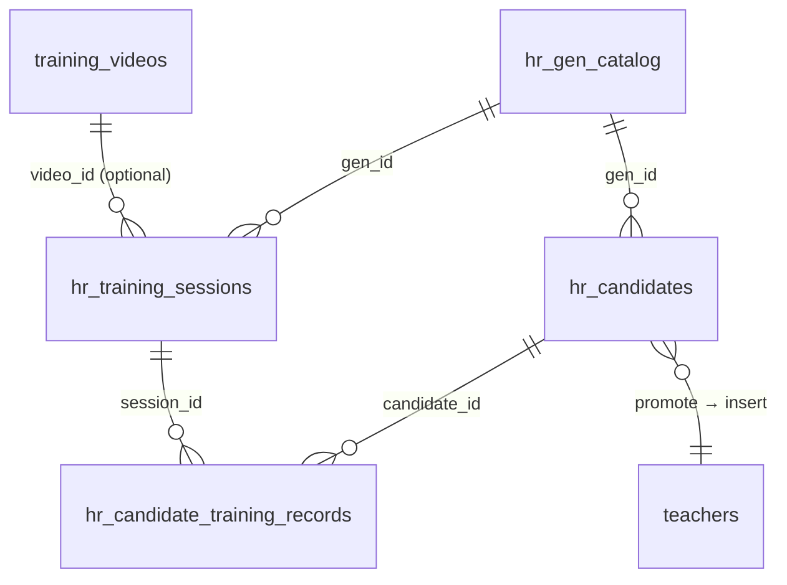

# Design Document — HR Onboarding Training

## Overview

Tính năng **Đào tạo đầu vào (HR Onboarding Training)** bổ sung một module quản lý vòng đời ứng viên mới vào hệ thống TPS hiện tại. Module này cho phép HR/quản lý:

1. Nhập và quản lý danh sách ứng viên (thủ công hoặc CSV import)
2. Tạo và quản lý 4 buổi training cho mỗi GEN
3. Ghi nhận điểm danh và điểm kiểm tra từng buổi
4. Đánh giá pass/fail và promote ứng viên đạt sang bảng `teachers`
5. Xem dashboard tổng quan theo GEN

Hệ thống được xây dựng trên Next.js 15 + TypeScript + PostgreSQL + Tailwind CSS, tái sử dụng các pattern và middleware hiện có (`requireBearerSession`, `withApiProtection`, upsert pattern từ `hr_gen_attendance_records`).

---

## Architecture

### Tổng quan luồng dữ liệu

```mermaid
flowchart TD
    HR[HR Manager] -->|CRUD / CSV Import| CandidateAPI[/api/hr/onboarding/candidates]
    HR -->|Tạo buổi training| SessionAPI[/api/hr/onboarding/sessions]
    HR -->|Ghi điểm danh + điểm| RecordAPI[/api/hr/onboarding/records]
    HR -->|Promote passed| PromoteAPI[/api/hr/onboarding/promote]

    CandidateAPI --> DB_Candidates[(hr_candidates)]
    SessionAPI --> DB_Sessions[(hr_training_sessions)]
    RecordAPI --> DB_Records[(hr_candidate_training_records)]
    RecordAPI -->|Auto status update| DB_Candidates
    PromoteAPI -->|Insert| DB_Teachers[(teachers)]
    PromoteAPI -->|Update status| DB_Candidates

    DB_Sessions -.->|FK| DB_GenCatalog[(hr_gen_catalog)]
    DB_Candidates -.->|FK| DB_GenCatalog
    DB_Sessions -.->|FK optional| DB_Videos[(training_videos)]

    UI_Dashboard[/admin/hr-onboarding] --> CandidateAPI
    UI_Dashboard --> SessionAPI
    UI_GenDetail[/admin/hr-onboarding/gen] --> RecordAPI
    UI_GenDetail --> PromoteAPI
```

### Phân lớp

```
app/
  api/hr/onboarding/
    candidates/route.ts   — CRUD ứng viên + CSV import
    sessions/route.ts     — CRUD buổi training
    records/route.ts      — Ghi nhận điểm danh/điểm (batch upsert)
    promote/route.ts      — Promote passed → teachers
  admin/hr-onboarding/
    page.tsx              — Dashboard + danh sách ứng viên
    [gen]/page.tsx        — Chi tiết GEN, bảng điểm danh

lib/
  migrations.ts           — Thêm V66_hr_onboarding_training
```

---

## Components and Interfaces

### API Routes

#### `GET /api/hr/onboarding/candidates`
Query params: `gen_id`, `status`, `region_code`, `search`, `page`, `pageSize`

Response:
```typescript
{
  success: true,
  rows: CandidateRow[],
  pagination: { page, pageSize, total, totalPages },
  summary: { total, byStatus, avgAttendanceScore, avgTestScore }
}
```

#### `POST /api/hr/onboarding/candidates`
Body: `{ full_name, email, phone, region_code, desired_campus, work_block, subject_code, gen_id }`

#### `PATCH /api/hr/onboarding/candidates`
Body: `{ id, full_name?, phone?, desired_campus?, work_block?, subject_code? }`

#### `DELETE /api/hr/onboarding/candidates?id=`
Từ chối nếu status là `in_training`, `passed`, hoặc `failed`.

#### `POST /api/hr/onboarding/candidates/import`
Body: `multipart/form-data` với field `file` (CSV UTF-8)

Response:
```typescript
{
  success: true,
  summary: { total: number, inserted: number, skipped: number, reasons: string[] }
}
```

---

#### `GET /api/hr/onboarding/sessions?gen_id=`
Response: `{ success: true, sessions: TrainingSession[] }` — sorted by session_number ASC

#### `POST /api/hr/onboarding/sessions`
Body: `{ gen_id, session_number, title, session_date, video_id? }`

#### `PATCH /api/hr/onboarding/sessions`
Body: `{ id, title?, session_date?, video_id? }`

---

#### `GET /api/hr/onboarding/records?gen_id=&session_id=`
Response: `{ success: true, records: TrainingRecord[], candidateSummaries: CandidateSummary[] }`

#### `PATCH /api/hr/onboarding/records`
Body: `{ records: Array<{ candidate_id, session_id, attendance, score }> }` — batch upsert

---

#### `POST /api/hr/onboarding/promote`
Body: `{ candidate_id, status: 'passed' | 'failed' | 'dropped' }`

Response:
```typescript
{
  success: true,
  candidate: { id, status },
  teacherInserted?: boolean,
  teacherAlreadyExists?: boolean
}
```

---

### TypeScript Interfaces

```typescript
// hr_candidates
interface HrCandidate {
  id: number;
  full_name: string;
  email: string;
  phone: string | null;
  region_code: string | null;
  desired_campus: string | null;
  work_block: string | null;
  subject_code: string | null;
  gen_id: number | null;
  status: 'new' | 'in_training' | 'passed' | 'failed' | 'dropped';
  source: 'manual' | 'csv';
  created_by_email: string;
  updated_by_email: string | null;
  created_at: string;
  updated_at: string;
}

// hr_training_sessions
interface TrainingSession {
  id: number;
  gen_id: number;
  session_number: 1 | 2 | 3 | 4;
  title: string;
  session_date: string | null;
  video_id: number | null;
  created_by_email: string;
  created_at: string;
  updated_at: string;
}

// hr_candidate_training_records
interface TrainingRecord {
  id: number;
  candidate_id: number;
  session_id: number;
  attendance: boolean;
  score: number | null;  // 0–10, clamped
  recorded_by_email: string;
  created_at: string;
  updated_at: string;
}

// Computed per candidate
interface CandidateSummary {
  candidate_id: number;
  full_name: string;
  email: string;
  status: string;
  sessions: Array<{ session_id: number; attendance: boolean; score: number | null }>;
  attendance_score: number;  // (attended / total) * 10, rounded 2dp
  avg_test_score: number | null;
}
```

---

## Data Models

### Bảng mới: `hr_candidates`

```sql
CREATE TABLE IF NOT EXISTS hr_candidates (
  id                SERIAL PRIMARY KEY,
  full_name         VARCHAR(255) NOT NULL,
  email             VARCHAR(255) NOT NULL,
  phone             VARCHAR(50),
  region_code       VARCHAR(10),
  desired_campus    VARCHAR(255),
  work_block        VARCHAR(100),
  subject_code      VARCHAR(100),
  gen_id            INTEGER REFERENCES hr_gen_catalog(id) ON DELETE SET NULL,
  status            VARCHAR(20) NOT NULL DEFAULT 'new'
                    CHECK (status IN ('new', 'in_training', 'passed', 'failed', 'dropped')),
  source            VARCHAR(20) NOT NULL DEFAULT 'manual'
                    CHECK (source IN ('manual', 'csv')),
  created_by_email  VARCHAR(255) NOT NULL,
  updated_by_email  VARCHAR(255),
  created_at        TIMESTAMP DEFAULT CURRENT_TIMESTAMP,
  updated_at        TIMESTAMP DEFAULT CURRENT_TIMESTAMP,
  CONSTRAINT uq_hr_candidates_email_gen UNIQUE (email, gen_id)
);

CREATE INDEX IF NOT EXISTS idx_hr_candidates_gen_id ON hr_candidates(gen_id);
CREATE INDEX IF NOT EXISTS idx_hr_candidates_status ON hr_candidates(status);
CREATE INDEX IF NOT EXISTS idx_hr_candidates_email ON hr_candidates(email);
```

### Bảng mới: `hr_training_sessions`

```sql
CREATE TABLE IF NOT EXISTS hr_training_sessions (
  id                SERIAL PRIMARY KEY,
  gen_id            INTEGER NOT NULL REFERENCES hr_gen_catalog(id) ON DELETE CASCADE,
  session_number    INTEGER NOT NULL CHECK (session_number BETWEEN 1 AND 4),
  title             VARCHAR(500) NOT NULL,
  session_date      DATE,
  video_id          INTEGER REFERENCES training_videos(id) ON DELETE SET NULL,
  created_by_email  VARCHAR(255) NOT NULL,
  created_at        TIMESTAMP DEFAULT CURRENT_TIMESTAMP,
  updated_at        TIMESTAMP DEFAULT CURRENT_TIMESTAMP,
  CONSTRAINT uq_hr_training_sessions_gen_session UNIQUE (gen_id, session_number)
);

CREATE INDEX IF NOT EXISTS idx_hr_training_sessions_gen_id ON hr_training_sessions(gen_id);
```

### Bảng mới: `hr_candidate_training_records`

```sql
CREATE TABLE IF NOT EXISTS hr_candidate_training_records (
  id                SERIAL PRIMARY KEY,
  candidate_id      INTEGER NOT NULL REFERENCES hr_candidates(id) ON DELETE CASCADE,
  session_id        INTEGER NOT NULL REFERENCES hr_training_sessions(id) ON DELETE CASCADE,
  attendance        BOOLEAN NOT NULL DEFAULT FALSE,
  score             DECIMAL(4,2) CHECK (score >= 0 AND score <= 10),
  recorded_by_email VARCHAR(255) NOT NULL,
  created_at        TIMESTAMP DEFAULT CURRENT_TIMESTAMP,
  updated_at        TIMESTAMP DEFAULT CURRENT_TIMESTAMP,
  CONSTRAINT uq_hr_training_record UNIQUE (candidate_id, session_id)
);

CREATE INDEX IF NOT EXISTS idx_hr_training_records_candidate ON hr_candidate_training_records(candidate_id);
CREATE INDEX IF NOT EXISTS idx_hr_training_records_session ON hr_candidate_training_records(session_id);
```

### Cột bổ sung vào `teachers`

Bảng `teachers` hiện có đủ cột cần thiết (`code`, `full_name`, `work_email`, `main_centre`, `course_line`, `status`). Cần thêm cột `source` để ghi nhận nguồn gốc:

```sql
ALTER TABLE teachers ADD COLUMN IF NOT EXISTS source VARCHAR(50);
```

### Migration V66

Migration mới được thêm vào `lib/migrations.ts` theo pattern hiện có:

```typescript
{
  name: 'V66_hr_onboarding_training',
  version: 66,
  sql: `
    -- hr_candidates
    CREATE TABLE IF NOT EXISTS hr_candidates ( ... );
    -- hr_training_sessions
    CREATE TABLE IF NOT EXISTS hr_training_sessions ( ... );
    -- hr_candidate_training_records
    CREATE TABLE IF NOT EXISTS hr_candidate_training_records ( ... );
    -- teachers.source
    ALTER TABLE teachers ADD COLUMN IF NOT EXISTS source VARCHAR(50);
    -- Triggers
    ...
    -- Permissions
    INSERT INTO app_permissions ...
  `
}
```

### Quan hệ giữa các bảng



---

## Correctness Properties

*A property is a characteristic or behavior that should hold true across all valid executions of a system — essentially, a formal statement about what the system should do. Properties serve as the bridge between human-readable specifications and machine-verifiable correctness guarantees.*

### Property 1: Candidate creation sets correct defaults

*For any* valid candidate data submitted by an HR Manager, the saved record SHALL have `status = 'new'` and `created_by_email` equal to the session email of the submitter.

**Validates: Requirements 1.2**

---

### Property 2: Duplicate candidate rejection

*For any* (email, gen_id) pair, if a candidate with that combination already exists in `hr_candidates`, then a second insert attempt SHALL return a conflict error and the total count of candidates with that (email, gen_id) SHALL remain 1.

**Validates: Requirements 1.3**

---

### Property 3: CSV import filters invalid rows

*For any* CSV file containing a mix of valid rows (non-empty full_name and email) and invalid rows (missing full_name or email), the import SHALL insert only valid rows with `source = 'csv'` and `status = 'new'`, and skip all invalid rows.

**Validates: Requirements 1.5**

---

### Property 4: CSV import summary completeness

*For any* CSV input, the import response SHALL always contain the fields: `total`, `inserted`, `skipped`, and `reasons`, where `total = inserted + skipped`.

**Validates: Requirements 1.6**

---

### Property 5: Pagination size invariant

*For any* candidate list query with a given `pageSize` (1 ≤ pageSize ≤ 200), the number of rows returned SHALL never exceed `pageSize`.

**Validates: Requirements 1.7**

---

### Property 6: Candidate update round-trip

*For any* candidate and any valid field update (full_name, phone, desired_campus, work_block, subject_code), reading back the candidate after the update SHALL return the new values, and `updated_at` SHALL be greater than or equal to the previous `updated_at`.

**Validates: Requirements 1.8**

---

### Property 7: Protected status deletion rejection

*For any* candidate with `status` in `{'in_training', 'passed', 'failed'}`, a DELETE request SHALL return an error and the candidate SHALL remain in the database.

**Validates: Requirements 1.9**

---

### Property 8: Session number uniqueness per GEN

*For any* GEN and any `session_number` in [1, 4], if a session with that (gen_id, session_number) already exists, a second create attempt SHALL return a conflict error and the total count of sessions with that combination SHALL remain 1.

**Validates: Requirements 2.2**

---

### Property 9: Session list ordering

*For any* GEN with multiple training sessions, the returned list SHALL be sorted by `session_number` in ascending order.

**Validates: Requirements 2.3**

---

### Property 10: Session number boundary validation

*For any* `session_number` value outside the range [1, 4], a create request SHALL return a validation error.

**Validates: Requirements 2.5**

---

### Property 11: Training record upsert idempotence

*For any* (candidate_id, session_id) pair, submitting a training record twice SHALL result in exactly one record in `hr_candidate_training_records`, with the values from the second submission.

**Validates: Requirements 3.2**

---

### Property 12: Score clamping invariant

*For any* submitted score value `s`, the value saved to the database SHALL equal `max(0, min(10, s))`. In particular, for any `s < 0` the saved value SHALL be `0`, and for any `s > 10` the saved value SHALL be `10`.

**Validates: Requirements 3.3**

---

### Property 13: Auto status transition to in_training

*For any* candidate with `status = 'new'`, saving a training record for that candidate SHALL automatically update the candidate's `status` to `'in_training'`.

**Validates: Requirements 3.5**

---

### Property 14: Attendance score formula correctness

*For any* candidate with `k` sessions attended (attendance = true) out of `n` total sessions in their GEN, the computed `attendance_score` SHALL equal `round((k / n) * 10, 2)`.

**Validates: Requirements 3.6**

---

### Property 15: Average test score formula correctness

*For any* candidate with a set of recorded scores `S = {s1, s2, ..., sm}` (m ≥ 1), the computed `avg_test_score` SHALL equal `round(sum(S) / m, 2)`.

**Validates: Requirements 3.7**

---

### Property 16: Promote to teachers — field mapping

*For any* candidate promoted to `passed`, the inserted record in `teachers` SHALL have:
- `work_email` = candidate's `email`
- `full_name` = candidate's `full_name`
- `main_centre` = candidate's `desired_campus`
- `course_line` = candidate's `subject_code`
- `status` = `'Active'`
- `source` = `'hr_onboarding'`

**Validates: Requirements 4.2, 4.3**

---

### Property 17: Promote idempotence (no duplicate teachers)

*For any* candidate, promoting them to `passed` twice SHALL result in exactly one record in `teachers` with their email. The second promote SHALL return a notice that the teacher already exists.

**Validates: Requirements 4.4**

---

### Property 18: Failed/dropped status does not affect teachers table

*For any* candidate set to `failed` or `dropped`, the total count of records in the `teachers` table SHALL remain unchanged.

**Validates: Requirements 4.5**

---

### Property 19: Status change audit trail

*For any* status change operation, the `updated_by_email` field in `hr_candidates` SHALL equal the session email of the HR Manager who performed the change.

**Validates: Requirements 4.6**

---

### Property 20: Region filter scoping

*For any* dashboard query filtered by `region_code`, all returned candidates SHALL have `region_code` matching the filter value.

**Validates: Requirements 5.3**

---

### Property 21: Access control — unauthenticated requests

*For any* endpoint under `/api/hr/onboarding/*`, a request without a valid Bearer token SHALL return HTTP 401.

**Validates: Requirements 6.2**

---

### Property 22: Access control — unauthorized authenticated requests

*For any* authenticated user whose role is neither `super_admin` nor has permission for `/admin/hr-onboarding`, a request to any endpoint under `/api/hr/onboarding/*` SHALL return HTTP 403 with a Vietnamese error message.

**Validates: Requirements 6.3**

---

**Property Reflection — Redundancy Check:**

- Properties 16 and 17 are complementary, not redundant: 16 tests field mapping, 17 tests idempotence.
- Properties 14 and 15 are complementary: 14 tests attendance formula, 15 tests score average formula.
- Properties 21 and 22 are complementary: 21 tests unauthenticated (401), 22 tests authenticated-but-unauthorized (403).
- Properties 8 and 10 are complementary: 8 tests duplicate session, 10 tests out-of-range session_number.
- No redundancies identified — all 22 properties provide unique validation value.

---

## Error Handling

### Validation Errors (HTTP 400)
- `full_name` hoặc `email` bị thiếu khi tạo candidate
- `session_number` ngoài khoảng [1, 4]
- `gen_id` không tồn tại trong `hr_gen_catalog`
- CSV file không đúng encoding hoặc format

### Conflict Errors (HTTP 409)
- Duplicate (email, gen_id) khi tạo candidate
- Duplicate (gen_id, session_number) khi tạo session
- Tạo session thứ 5 cho một GEN

### Authorization Errors
- HTTP 401: Không có Bearer token hoặc session hết hạn
- HTTP 403: Đã xác thực nhưng không có quyền `super_admin` hoặc `/admin/hr-onboarding`

### Business Logic Errors (HTTP 422)
- Xóa candidate có status `in_training`, `passed`, hoặc `failed`
- Promote candidate không tồn tại

### Server Errors (HTTP 500)
- Lỗi database: log chi tiết server-side, trả về message chung cho client
- Tất cả handlers đều wrap trong try/catch và rollback transaction khi lỗi

### Score Clamping
Score ngoài [0, 10] không trả về lỗi — được clamp tự động trước khi lưu. Đây là behavior by design theo Requirement 3.3.

---

## Testing Strategy

### Dual Testing Approach

Tính năng này có logic nghiệp vụ rõ ràng (formula tính điểm, state machine status, upsert idempotence, field mapping khi promote) — phù hợp với property-based testing.

**Unit tests** tập trung vào:
- Các hàm tính toán thuần túy: `calculateAttendanceScore`, `calculateAvgTestScore`, `clampScore`
- CSV parsing: `parseCsvRow`, `validateCsvRow`
- Field mapping khi promote: `mapCandidateToTeacher`
- Validation logic: `validateSessionNumber`, `validateCandidateStatus`

**Property-based tests** tập trung vào:
- Các invariant của formula tính điểm (Properties 14, 15)
- Score clamping (Property 12)
- Upsert idempotence (Property 11)
- Promote idempotence (Property 17)
- CSV import filtering (Property 3)
- Pagination size invariant (Property 5)

**Integration tests** tập trung vào:
- API endpoints end-to-end với database thật (test DB)
- Middleware auth: 401/403 responses
- Batch upsert với nhiều records

### Property-Based Testing Library

Sử dụng **fast-check** (TypeScript-native, không cần cài thêm):

```bash
npm install --save-dev fast-check
```

Mỗi property test chạy tối thiểu **100 iterations**.

Tag format cho mỗi test:
```
// Feature: hr-onboarding-training, Property {N}: {property_text}
```

### Ví dụ property test

```typescript
import fc from 'fast-check';
import { calculateAttendanceScore } from '@/lib/hr-onboarding-utils';

// Feature: hr-onboarding-training, Property 14: Attendance score formula correctness
test('attendance score formula', () => {
  fc.assert(
    fc.property(
      fc.integer({ min: 0, max: 4 }),  // k: sessions attended
      fc.integer({ min: 1, max: 4 }),  // n: total sessions
      (k, n) => {
        const attended = Math.min(k, n);
        const score = calculateAttendanceScore(attended, n);
        const expected = Math.round((attended / n) * 10 * 100) / 100;
        return Math.abs(score - expected) < 0.001;
      }
    ),
    { numRuns: 100 }
  );
});

// Feature: hr-onboarding-training, Property 12: Score clamping invariant
test('score clamping', () => {
  fc.assert(
    fc.property(
      fc.float({ min: -100, max: 100 }),
      (score) => {
        const clamped = clampScore(score);
        return clamped >= 0 && clamped <= 10;
      }
    ),
    { numRuns: 100 }
  );
});
```

### Test Coverage Targets

| Layer | Target |
|-------|--------|
| Pure functions (utils) | 90%+ |
| API route handlers | 80%+ |
| UI components | 70%+ |
