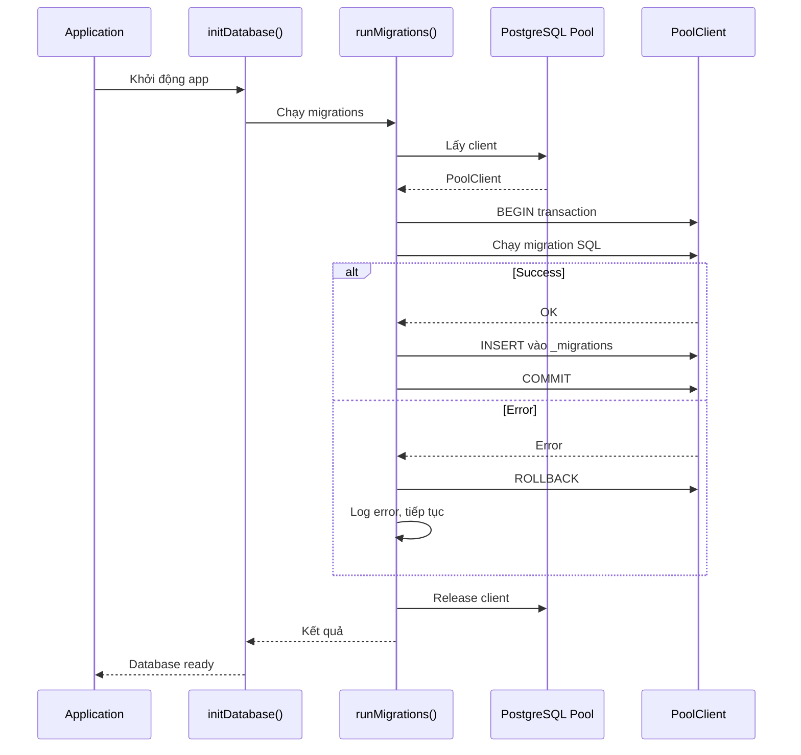

# Design Document: Optimize Migrations System

## Tổng quan

File `lib/migrations.ts` hiện tại có 3180 dòng với 62 migrations, gặp nhiều vấn đề về cú pháp, dependencies, và performance. Thiết kế này tập trung vào việc sửa lỗi ngay lập tức để hệ thống chạy được, đồng thời cải thiện error handling, logging, và performance cho các migrations phức tạp.

## Kiến trúc chính



## Các thành phần chính

### 1. Migration Interface

```typescript
interface Migration {
  name: string;
  version: number;
  sql: string;
}
```

**Trách nhiệm:**
- Định nghĩa cấu trúc của một migration
- Chứa SQL script và metadata

### 2. runMigrations Function

```typescript
async function runMigrations(pool: Pool): Promise<{
  success: boolean;
  applied: string[];
  errors: string[];
}>
```

**Preconditions:**
- Pool connection phải valid và connected
- Database phải accessible

**Postconditions:**
- Tất cả migrations chưa chạy được thực thi hoặc log error
- Bảng _migrations được cập nhật với migrations thành công
- Trả về danh sách migrations đã apply và errors

**Loop Invariants:**
- Mỗi migration chỉ chạy một lần
- Transaction được rollback nếu migration fail
- Client luôn được release về pool

### 3. initDatabase Function

```typescript
async function initDatabase(pool: Pool): Promise<void>
```

**Preconditions:**
- Pool connection phải valid
- Chưa được gọi trước đó (migrationRan = false)

**Postconditions:**
- Tất cả migrations được chạy
- migrationRan = true
- Console log kết quả

## Thuật toán chính

### Thuật toán: runMigrations

```pascal
ALGORITHM runMigrations(pool)
INPUT: pool of type Pool
OUTPUT: result of type {success: boolean, applied: string[], errors: string[]}

BEGIN
  applied ← []
  errors ← []
  client ← NULL
  
  TRY
    // Lấy client từ pool
    client ← pool.connect()
    
    // Tạo bảng _migrations nếu chưa có
    EXECUTE "CREATE TABLE IF NOT EXISTS _migrations (...)"
    
    // Lấy danh sách migrations đã chạy
    result ← QUERY "SELECT name FROM _migrations"
    appliedMigrations ← SET(result.rows.map(r => r.name))
    
    // Chạy từng migration chưa applied
    FOR EACH migration IN migrations DO
      ASSERT migration.name IS NOT NULL
      ASSERT migration.version > 0
      
      IF migration.name IN appliedMigrations THEN
        CONTINUE  // Đã chạy rồi, bỏ qua
      END IF
      
      TRY
        EXECUTE "BEGIN"
        EXECUTE migration.sql
        EXECUTE "INSERT INTO _migrations (name, version) VALUES (...)"
        EXECUTE "COMMIT"
        
        applied.push(migration.name)
        LOG "✅ Migration applied: " + migration.name
      CATCH error
        EXECUTE "ROLLBACK"
        errors.push("Migration " + migration.name + " failed: " + error.message)
        LOG "❌ Migration failed: " + migration.name
        // Tiếp tục với migration tiếp theo
      END TRY
    END FOR
    
    RETURN {success: errors.length = 0, applied: applied, errors: errors}
  CATCH error
    LOG "❌ Migration system error: " + error.message
    RETURN {success: false, applied: applied, errors: [error.message]}
  FINALLY
    IF client ≠ NULL THEN
      client.release()
    END IF
  END TRY
END
```

**Preconditions:**
- pool là PostgreSQL Pool hợp lệ
- pool.connect() có thể lấy được client

**Postconditions:**
- Tất cả migrations chưa chạy được thực thi hoặc log error
- Client luôn được release về pool
- Trả về object với success, applied, errors

**Loop Invariants:**
- Mỗi migration chỉ được thử chạy một lần
- appliedMigrations set không thay đổi trong vòng lặp
- Client connection vẫn valid trong suốt vòng lặp

### Thuật toán: Sửa lỗi DO block syntax

```pascal
ALGORITHM fixDOBlockSyntax(migrationSQL)
INPUT: migrationSQL of type string
OUTPUT: fixedSQL of type string

BEGIN
  // Tìm tất cả DO blocks với cú pháp sai
  pattern ← "DO \$\s*BEGIN"
  
  // Thay thế DO $ bằng DO $$
  fixedSQL ← REPLACE(migrationSQL, "DO $", "DO $$")
  fixedSQL ← REPLACE(fixedSQL, "END $;", "END $$;")
  
  RETURN fixedSQL
END
```

**Preconditions:**
- migrationSQL là string hợp lệ

**Postconditions:**
- Tất cả DO blocks sử dụng cú pháp đúng (DO $$)
- SQL có thể execute mà không lỗi syntax

### Thuật toán: Kiểm tra dependencies

```pascal
ALGORITHM checkDependencies(migration)
INPUT: migration of type Migration
OUTPUT: canRun of type boolean

BEGIN
  dependencies ← extractDependencies(migration.sql)
  
  FOR EACH dep IN dependencies DO
    IF NOT tableExists(dep.tableName) THEN
      LOG "⚠️ Dependency missing: " + dep.tableName
      RETURN false
    END IF
    
    IF dep.type = "FOREIGN_KEY" THEN
      IF NOT tableExists(dep.referencedTable) THEN
        LOG "⚠️ Referenced table missing: " + dep.referencedTable
        RETURN false
      END IF
    END IF
  END FOR
  
  RETURN true
END
```

**Preconditions:**
- migration.sql là SQL script hợp lệ

**Postconditions:**
- Trả về true nếu tất cả dependencies tồn tại
- Trả về false và log warning nếu thiếu dependency

**Loop Invariants:**
- Mỗi dependency chỉ được kiểm tra một lần
- Nếu tìm thấy dependency thiếu, return ngay lập tức

## Ví dụ sử dụng

### Ví dụ 1: Sửa lỗi DO block trong V2

```typescript
// TRƯỚC (SAI):
{
  name: 'create_updated_at_function',
  version: 2,
  sql: `
    CREATE OR REPLACE FUNCTION update_updated_at_column()
    RETURNS TRIGGER AS $
    BEGIN
        NEW.updated_at = CURRENT_TIMESTAMP;
        RETURN NEW;
    END;
    $ language 'plpgsql';
  `,
}

// SAU (ĐÚNG):
{
  name: 'create_updated_at_function',
  version: 2,
  sql: `
    CREATE OR REPLACE FUNCTION update_updated_at_column()
    RETURNS TRIGGER AS $$
    BEGIN
        NEW.updated_at = CURRENT_TIMESTAMP;
        RETURN NEW;
    END;
    $$ language 'plpgsql';
  `,
}
```

### Ví dụ 2: Thêm defensive check cho V22

```typescript
// TRƯỚC (KHÔNG AN TOÀN):
{
  name: 'V22_role_based_permissions',
  version: 22,
  sql: `
    CREATE TABLE IF NOT EXISTS role_permissions (
      id SERIAL PRIMARY KEY,
      role_code VARCHAR(20) NOT NULL REFERENCES roles(role_code) ON DELETE CASCADE,
      ...
    );
  `,
}

// SAU (AN TOÀN):
{
  name: 'V22_role_based_permissions',
  version: 22,
  sql: `
    DO $$
    BEGIN
      -- Kiểm tra table roles tồn tại
      IF NOT EXISTS (
        SELECT 1 FROM information_schema.tables 
        WHERE table_schema = 'public' AND table_name = 'roles'
      ) THEN
        RAISE NOTICE 'Table roles does not exist, skipping role_permissions creation';
        RETURN;
      END IF;
      
      -- Tạo table nếu roles tồn tại
      CREATE TABLE IF NOT EXISTS role_permissions (
        id SERIAL PRIMARY KEY,
        role_code VARCHAR(20) NOT NULL REFERENCES roles(role_code) ON DELETE CASCADE,
        route_path VARCHAR(255) NOT NULL,
        created_at TIMESTAMP DEFAULT CURRENT_TIMESTAMP,
        UNIQUE(role_code, route_path)
      );
      
      CREATE INDEX IF NOT EXISTS idx_role_permissions_role ON role_permissions(role_code);
    END $$;
  `,
}
```

### Ví dụ 3: Tách migration phức tạp V43

```typescript
// TRƯỚC: V43 có 500+ dòng tạo 11 tables + backfill data

// SAU: Tách thành nhiều migrations nhỏ
{
  name: 'V43_1_create_chuyensau_core_tables',
  version: 43,
  sql: `
    -- Chỉ tạo 3 tables cơ bản
    CREATE TABLE IF NOT EXISTS chuyensau_subjects (...);
    CREATE TABLE IF NOT EXISTS chuyensau_sets (...);
    CREATE TABLE IF NOT EXISTS chuyensau_questions (...);
  `,
},
{
  name: 'V43_2_create_chuyensau_mapping_tables',
  version: 44,
  sql: `
    -- Tạo mapping tables
    CREATE TABLE IF NOT EXISTS chuyensau_set_questions (...);
    CREATE TABLE IF NOT EXISTS chuyensau_monthly_selections (...);
  `,
},
{
  name: 'V43_3_backfill_chuyensau_data',
  version: 45,
  sql: `
    -- Backfill data với batch processing
    DO $$
    DECLARE
      batch_size INT := 1000;
      offset_val INT := 0;
      rows_affected INT;
    BEGIN
      LOOP
        INSERT INTO chuyensau_subjects (...)
        SELECT ... FROM exam_subject_catalog
        LIMIT batch_size OFFSET offset_val;
        
        GET DIAGNOSTICS rows_affected = ROW_COUNT;
        EXIT WHEN rows_affected = 0;
        
        offset_val := offset_val + batch_size;
        RAISE NOTICE 'Backfilled % subjects', offset_val;
      END LOOP;
    END $$;
  `,
}
```

## Correctness Properties

### Property 1: Migration Idempotency
```typescript
// Mỗi migration chỉ chạy một lần
FORALL m IN migrations:
  appliedMigrations.has(m.name) => m KHÔNG được chạy lại
```

### Property 2: Transaction Atomicity
```typescript
// Migration thành công hoặc rollback hoàn toàn
FORALL m IN migrations:
  (m.success => _migrations.has(m.name) AND database.hasChanges(m))
  OR
  (m.failed => NOT _migrations.has(m.name) AND NOT database.hasChanges(m))
```

### Property 3: Client Resource Management
```typescript
// Client luôn được release
FORALL execution IN runMigrations():
  execution.end => client.released = true
```

### Property 4: Error Isolation
```typescript
// Lỗi ở một migration không ảnh hưởng migrations khác
FORALL m1, m2 IN migrations WHERE m1 ≠ m2:
  m1.failed => m2 VẪN được thử chạy
```

### Property 5: Dependency Safety
```typescript
// Migration không chạy nếu thiếu dependency
FORALL m IN migrations:
  m.hasDependencies() AND NOT m.dependenciesExist() => m.skipped
```

## Xử lý lỗi

### Lỗi 1: DO block syntax error

**Điều kiện:** Migration sử dụng `DO $` thay vì `DO $$`

**Phản ứng:** 
- Sửa tất cả `DO $` thành `DO $$`
- Sửa tất cả `END $;` thành `END $$;`
- Migrations bị ảnh hưởng: V2, V21, V22, V31, V39, V40, V59, V62

**Khôi phục:** Không cần rollback, chỉ cần sửa code

### Lỗi 2: Missing dependency table

**Điều kiện:** Migration tham chiếu table chưa tồn tại

**Phản ứng:**
- Thêm defensive check với `to_regclass()` hoặc `information_schema.tables`
- Log warning và skip migration nếu dependency thiếu
- Migrations bị ảnh hưởng: V22 (roles), V48 (exam_* tables)

**Khôi phục:** Migration sẽ tự động chạy khi dependency được tạo

### Lỗi 3: Migration quá phức tạp

**Điều kiện:** Migration có >200 dòng hoặc tạo >5 tables

**Phản ứng:**
- Tách thành nhiều migrations nhỏ hơn
- Mỗi migration tập trung vào một nhiệm vụ cụ thể
- Migrations bị ảnh hưởng: V43 (500+ dòng), V48 (400+ dòng)

**Khôi phục:** Không cần rollback, chỉ cần refactor code

### Lỗi 4: Backfill data chậm

**Điều kiện:** Migration backfill data lớn không có batch processing

**Phản ứng:**
- Thêm batch processing với LIMIT/OFFSET
- Thêm progress logging
- Thêm timeout protection
- Migrations bị ảnh hưởng: V43 (backfill phase)

**Khôi phục:** Có thể resume từ offset cuối cùng

## Chiến lược testing

### Unit Testing

**Test 1: Migration syntax validation**
```typescript
test('all migrations have valid DO block syntax', () => {
  migrations.forEach(m => {
    expect(m.sql).not.toMatch(/DO \$\s+BEGIN/);
    expect(m.sql).not.toMatch(/END \$;/);
  });
});
```

**Test 2: Migration uniqueness**
```typescript
test('all migration names are unique', () => {
  const names = migrations.map(m => m.name);
  const uniqueNames = new Set(names);
  expect(names.length).toBe(uniqueNames.size);
});
```

**Test 3: Version ordering**
```typescript
test('migration versions are sequential', () => {
  for (let i = 1; i < migrations.length; i++) {
    expect(migrations[i].version).toBeGreaterThan(migrations[i-1].version);
  }
});
```

### Property-Based Testing

**Property Test Library**: fast-check (TypeScript)

**Property 1: Idempotency**
```typescript
import fc from 'fast-check';

test('running migrations twice produces same result', async () => {
  await fc.assert(
    fc.asyncProperty(fc.array(fc.record({
      name: fc.string(),
      version: fc.integer({min: 1}),
      sql: fc.constant('SELECT 1')
    })), async (testMigrations) => {
      const result1 = await runMigrations(pool, testMigrations);
      const result2 = await runMigrations(pool, testMigrations);
      
      expect(result2.applied).toEqual([]);
      expect(result1.applied.length).toBeGreaterThanOrEqual(0);
    })
  );
});
```

**Property 2: Transaction rollback**
```typescript
test('failed migration does not leave partial changes', async () => {
  await fc.assert(
    fc.asyncProperty(fc.string(), async (invalidSQL) => {
      const failingMigration = {
        name: 'test_failing',
        version: 999,
        sql: invalidSQL
      };
      
      const beforeTables = await getTableList(pool);
      await runMigrations(pool, [failingMigration]);
      const afterTables = await getTableList(pool);
      
      expect(beforeTables).toEqual(afterTables);
    })
  );
});
```

### Integration Testing

**Test 1: Full migration run**
```typescript
test('all migrations run successfully on fresh database', async () => {
  const result = await runMigrations(pool);
  
  expect(result.success).toBe(true);
  expect(result.errors).toEqual([]);
  expect(result.applied.length).toBe(migrations.length);
});
```

**Test 2: Resume after failure**
```typescript
test('migrations resume after partial failure', async () => {
  // Chạy một phần migrations
  const partialMigrations = migrations.slice(0, 10);
  await runMigrations(pool, partialMigrations);
  
  // Chạy tất cả migrations
  const result = await runMigrations(pool, migrations);
  
  // Chỉ migrations mới được apply
  expect(result.applied.length).toBe(migrations.length - 10);
});
```

## Performance Considerations

### 1. Connection Pooling
- Sử dụng một client duy nhất cho tất cả migrations
- Giảm overhead của việc tạo/đóng connections
- Client được release về pool sau khi hoàn thành

### 2. Batch Processing cho Data Migration
```typescript
// Thay vì:
INSERT INTO new_table SELECT * FROM old_table;

// Sử dụng:
DO $$
DECLARE
  batch_size INT := 1000;
  offset_val INT := 0;
BEGIN
  LOOP
    INSERT INTO new_table SELECT * FROM old_table
    LIMIT batch_size OFFSET offset_val;
    
    EXIT WHEN NOT FOUND;
    offset_val := offset_val + batch_size;
  END LOOP;
END $$;
```

### 3. Index Creation Strategy
- Tạo indexes SAU khi insert data
- Sử dụng CONCURRENTLY khi có thể
- Tránh tạo quá nhiều indexes trong một migration

### 4. Query Optimization
- Cache kết quả của `to_regclass()` checks
- Sử dụng prepared statements cho repeated queries
- Minimize số lượng round-trips đến database

## Security Considerations

### 1. SQL Injection Prevention
- Tất cả migrations sử dụng parameterized queries
- Không concatenate user input vào SQL strings
- Sử dụng `format()` với `%I` cho identifiers

### 2. Permission Management
- Migrations chỉ chạy với database owner permissions
- Không grant unnecessary permissions trong migrations
- Audit trail trong bảng _migrations

### 3. Data Validation
- Validate data trước khi backfill
- Sử dụng CHECK constraints
- Log invalid data thay vì fail migration

## Dependencies

### External Dependencies
- `pg` (PostgreSQL client): ^8.11.0
- `typescript`: ^5.0.0

### Internal Dependencies
- `lib/db.ts`: PostgreSQL Pool connection
- Không có dependencies khác

### Database Requirements
- PostgreSQL 12+
- Quyền CREATE TABLE, CREATE INDEX, CREATE FUNCTION
- Đủ disk space cho data migration

## Danh sách migrations cần sửa

### Ưu tiên 1: Lỗi cú pháp (CRITICAL - Sửa ngay)
1. **V2** (line 48): `DO $` → `DO $$`
2. **V21** (line 621): `DO $` → `DO $$`
3. **V22** (line 638): `DO $` → `DO $$` + thêm check table `roles`
4. **V31** (line 731): `DO $` → `DO $$`
5. **V39** (line 1089): `DO $` → `DO $$` + thêm check table `roles`
6. **V40** (line 1169): `DO $` → `DO $$` + thêm check table `roles`
7. **V59** (line 2920): `DO $` → `DO $$`
8. **V62** (line 3061): `DO $` → `DO $$`

### Ưu tiên 2: Missing dependencies (HIGH)
1. **V22** (line 638): Cần check table `roles` tồn tại
2. **V39** (line 1089): Cần check table `roles` tồn tại
3. **V40** (line 1169): Cần check table `roles` tồn tại
4. **V48** (line 1800): Cần check `exam_*` tables tồn tại

### Ưu tiên 3: Migrations phức tạp (MEDIUM)
1. **V43** (line 1300): 500+ dòng, cần tách thành 3-4 migrations
2. **V48** (line 1800): 400+ dòng, cần tách thành 2-3 migrations

### Ưu tiên 4: Performance (LOW)
1. **V43** backfill: Thêm batch processing
2. **V48** data migration: Thêm progress logging
