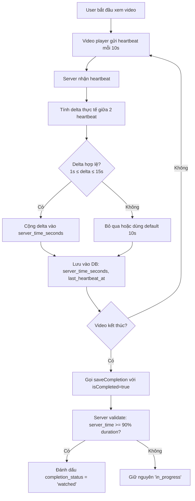
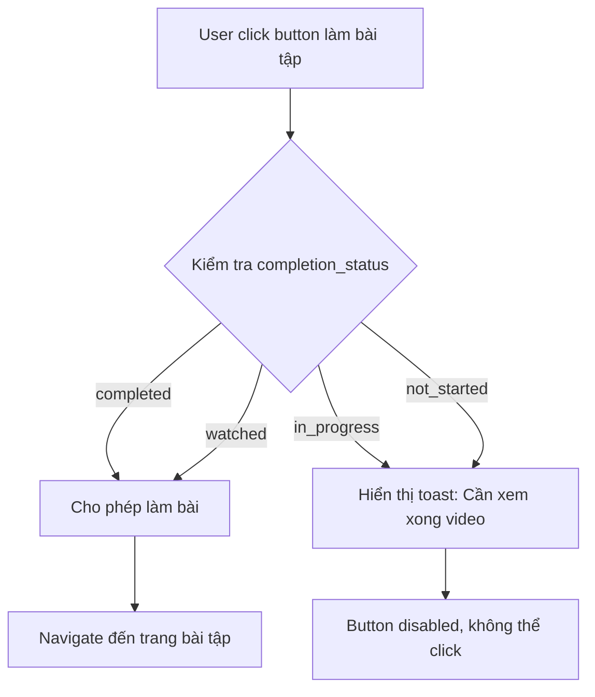

# 📊 Review Logic Video Completion & Quyền Làm Bài Tập

## Route: `/user/dao-tao-nang-cao`

---

## 🎯 1. KHI NÀO VIDEO ĐƯỢC TÍNH LÀ HOÀN THÀNH?

### 1.1. Các Trạng Thái Video (completion_status)

Video có 4 trạng thái chính:

| Trạng thái | Mô tả | Điều kiện |
|-----------|-------|-----------|
| `not_started` | Chưa bắt đầu xem | `time_spent_seconds = 0` hoặc không có record |
| `in_progress` | Đang xem | `time_spent_seconds > 0` nhưng chưa đủ điều kiện hoàn thành |
| `watched` | Đã xem xong | Xem đủ 90% thời lượng video VÀ có heartbeat từ TMS |
| `completed` | Hoàn thành (có làm bài tập) | Đã làm và nộp bài kiểm tra của video |

### 1.2. Logic Xác Định "Hoàn Thành" (Watched)

**File:** `app/api/training-progress/route.ts`

```typescript
const COMPLETION_THRESHOLD = 0.90; // 90%
```

**Điều kiện để video được đánh dấu `watched`:**

1. ✅ **Server time >= 90% duration video**
   ```typescript
   const minRequired = videoDurationSeconds * COMPLETION_THRESHOLD;
   if (clampedServerTime < minRequired) {
     validatedIsCompleted = false;
   }
   ```

2. ✅ **Có heartbeat từ TMS** (không chỉ import time_spent)
   - Hệ thống gửi heartbeat mỗi 10 giây
   - Server kiểm tra `last_heartbeat_at` và `server_time_seconds`
   - Chỉ tin tưởng thời gian xem nếu có heartbeat thực tế

3. ✅ **Server time được tính dựa trên delta thực tế:**
   ```typescript
   const HEARTBEAT_INTERVAL_S  = 10;   // client save mỗi 10s
   const MAX_HEARTBEAT_DELTA_S = 15;   // tối đa 15s mỗi heartbeat
   const MIN_HEARTBEAT_DELTA_S = 1;    // bỏ qua nếu quá nhanh (spam)
   ```

### 1.3. Logic Trong Frontend (lesson/page.tsx)

**Khi video kết thúc:**

```typescript
const handleEnded = () => {
  if (currentIndex < videoSegments.length - 1) {
    // Chuyển sang segment tiếp theo
    setCurrentIndex((prev) => prev + 1)
  } else {
    // Video cuối cùng kết thúc
    setProgress(100)
    setVideoCompleted(true)
    setIsPlaying(false)
    
    // Lưu completion ngay lập tức
    if (lessonIdRef.current && userRef.current?.email) {
      saveCompletion(lessonIdRef.current, totalDurationMap || duration)
    }
  }
}
```

**Hàm saveCompletion:**

```typescript
const saveCompletion = async (id: string | null, time: number) => {
  const currentUser = userRef.current
  if (!id || !currentUser?.email) return
  try {
    const teacherCode = currentUser.email.split('@')[0]
    await fetch('/api/training-progress', {
      method: 'POST',
      headers: { 'Content-Type': 'application/json' },
      body: JSON.stringify({
        teacherCode,
        videoId: id,
        timeSpent: time,
        isCompleted: true,  // ← Đánh dấu hoàn thành
        totalDuration: time,
      }),
    })
  } catch (err) {
    console.error('[Lesson] Failed to save completion:', err)
  }
}
```

### 1.4. Lưu Progress Định Kỳ (Mỗi 10 Giây)

```typescript
useEffect(() => {
  if (!isPlaying || !lessonId || !user?.email) return

  const teacherCode = user.email.split('@')[0]
  const interval = setInterval(async () => {
    const time = videoRef.current ? videoRef.current.currentTime : 0
    const duration = videoRef.current ? videoRef.current.duration : 0
    if (time <= 0) return

    try {
      await fetch('/api/training-progress', {
        method: 'POST',
        headers: { 'Content-Type': 'application/json' },
        body: JSON.stringify({
          teacherCode,
          videoId: lessonId,
          timeSpent: time,
          isCompleted: false,  // ← Chưa hoàn thành, chỉ lưu progress
          totalDuration: duration > 0 ? duration : undefined,
        }),
      })
    } catch (err) {
      console.error('[Lesson] Failed to save progress:', err)
    }
  }, 10000)  // ← Mỗi 10 giây

  return () => clearInterval(interval)
}, [isPlaying, lessonId, user])
```

---

## 🔐 2. KHI NÀO CÓ THỂ LÀM BÀI TẬP?

### 2.1. Điều Kiện Để Làm Bài Tập

**File:** `app/user/training/page.tsx`

```typescript
const isCompleted = lesson.completion_status === 'completed'
const isWatched = lesson.completion_status === 'watched'
const canTakeQuiz = isCompleted || isWatched  // ← Điều kiện chính
```

**Có thể làm bài tập khi:**
- ✅ Video có trạng thái `watched` (đã xem đủ 90%)
- ✅ HOẶC video có trạng thái `completed` (đã làm bài tập rồi)

### 2.2. UI Button Làm Bài Tập

```typescript
<button
  onClick={(e) => {
    e.stopPropagation()
    if (canTakeQuiz) {
      // Cho phép làm bài
      router.push(`/user/dao-tao-nang-cao?start_assignment_id=${assignment.id}`)
    } else {
      // Không cho phép - hiển thị thông báo
      import('@/lib/app-toast').then(({ toast }) => {
        toast.error(
          `Bạn cần hoàn thành xem video bài học trước khi làm bài tập này.`,
          { icon: '📺' }
        );
      });
    }
  }}
  className={`px-4 py-2 rounded-lg text-sm font-medium transition-all flex items-center gap-2 ${
    canTakeQuiz
      ? 'bg-[#a1001f] text-white hover:bg-[#8a001a] shadow-md hover:scale-105 active:scale-95 cursor-pointer'
      : 'bg-gray-100 text-gray-500 border border-gray-200 cursor-not-allowed opacity-80'
  }`}
>
```

### 2.3. Hiển Thị Trạng Thái Video

```typescript
<span className={`self-start px-3 py-1 rounded-full text-xs font-medium ${
  isCompleted
    ? 'bg-green-100 text-green-800'      // ✓ Hoàn thành
    : isWatched
      ? 'bg-blue-100 text-blue-800'      // 👁️ Đã xem
      : notStarted
        ? 'bg-gray-100 text-gray-800'    // Chưa học
        : passed
          ? 'bg-green-100 text-green-800' // ✓ Đã đạt
          : 'bg-yellow-100 text-yellow-800' // Điểm: X.X
}`}>
  {isCompleted
    ? '✓ Hoàn thành'
    : isWatched
      ? '👁️ Đã xem'
      : notStarted
        ? 'Chưa học'
        : passed
          ? '✓ Đã đạt'
          : 'Điểm: ' + lesson.score.toFixed(1)}
</span>
```

---

## 📋 3. DỰA VÀO ĐÂU ĐỂ XÁC ĐỊNH?

### 3.1. Database Schema

**Bảng:** `training_teacher_video_scores`

| Field | Type | Mô tả |
|-------|------|-------|
| `teacher_code` | VARCHAR | Mã giáo viên |
| `video_id` | INTEGER | ID video |
| `time_spent_seconds` | INTEGER | Thời gian xem (client report) |
| `server_time_seconds` | INTEGER | **Thời gian xem thực tế (server tính)** |
| `completion_status` | VARCHAR | Trạng thái: not_started, in_progress, watched, completed |
| `completed_at` | TIMESTAMP | Thời điểm hoàn thành |
| `last_heartbeat_at` | TIMESTAMP | **Heartbeat cuối cùng từ client** |
| `view_count` | INTEGER | Số lần xem |
| `score` | DECIMAL | Điểm bài tập (nếu có) |

### 3.2. Nguồn Dữ Liệu Tin Cậy

#### A. Server Time (Ưu tiên cao nhất)

```typescript
// API: /api/training-progress
const prevServerTime = Number(existing?.server_time_seconds) || 0;
const newServerTime  = prevServerTime + serverTimeDelta;

// serverTimeDelta được tính từ delta thực tế giữa 2 heartbeat
if (deltaSeconds >= MIN_HEARTBEAT_DELTA_S && deltaSeconds <= MAX_HEARTBEAT_DELTA_S) {
  serverTimeDelta = Math.floor(deltaSeconds);
}
```

**Tại sao tin tưởng server_time_seconds?**
- ✅ Được tính bởi server dựa trên delta thực tế
- ✅ Không thể fake từ client
- ✅ Có validation: delta phải trong khoảng 1-15 giây
- ✅ Có clamp: không vượt quá video duration + buffer

#### B. Heartbeat Validation

```typescript
// lib/training-effective-video-completion.ts
export function hasTmsWatchEvidenceForVideoIds(
  videoIds: number[],
  scoresMap: Map<number, TrainingScoreRowLike>,
): boolean {
  for (const id of videoIds) {
    const r = scoresMap.get(id)
    if (!r) continue
    if (Number(r.server_time_seconds) > 0) return true
    if (r.last_heartbeat_at != null && String(r.last_heartbeat_at).trim() !== '')
      return true
  }
  return false
}
```

**Chỉ tin tưởng completion nếu:**
- ✅ Có `server_time_seconds > 0`
- ✅ HOẶC có `last_heartbeat_at` (đã từng gửi heartbeat)

#### C. Video Duration

```typescript
// Ưu tiên: duration_seconds > duration_minutes
const videoDurationSeconds: number | null = meta?.duration_seconds
  ? Number(meta.duration_seconds)
  : meta?.duration_minutes
    ? Number(meta.duration_minutes) * 60
    : null;
```

### 3.3. Logic Effective Completion

**File:** `lib/training-effective-video-completion.ts`

```typescript
export function effectiveVideoCompletionFromRaw(
  input: EffectiveVideoCompletionInput,
): {
  completion_status: 'not_started' | 'in_progress' | 'watched' | 'completed'
  completed_at: string | null
} {
  // 1. Nếu đã completed (có bài kiểm tra) -> giữ nguyên
  if (raw === 'completed' || input.hasPlatformQuizEvidenceForVideo) {
    return { completion_status: 'completed', completed_at: completedAtStr }
  }

  // 2. Kiểm tra xem đủ 90% chưa
  const ratioOk = dur > 0
    ? cappedWatch >= dur * TRAINING_WATCH_COMPLETION_RATIO  // 90%
    : cappedWatch >= TRAINING_WATCH_FALLBACK_MIN_SECONDS    // 120s

  // 3. Chỉ khi xem đủ video trên TMS mới là 'watched'
  const watchOk = input.hasTmsWatchHeartbeat && ratioOk

  if (watchOk) {
    return { completion_status: 'watched', completed_at: completedAtStr }
  }

  // 4. Còn lại là in_progress hoặc not_started
  if (watched > 0) {
    return { completion_status: 'in_progress', completed_at: null }
  }
  return { completion_status: 'not_started', completed_at: null }
}
```

---

## 🔒 4. CƠ CHẾ CHỐNG GIAN LẬN

### 4.1. Anti-Cheat System

**File:** `app/user/training/lesson/page.tsx`

```typescript
// 1. Prototype patch: chặn rate > 1x tại nguồn
Object.defineProperty(HTMLMediaElement.prototype, 'playbackRate', {
  configurable: true,
  enumerable: true,
  get() {
    return nativeGet.call(this)
  },
  set(val: number) {
    // Chỉ cho phép tốc độ <= 1.0x
    nativeSet.call(this, Math.min(1.0, Math.max(0.1, Number(val) || 1)))
  },
})

// 2. Wall-clock check mỗi 500ms
const CHECK_INTERVAL = 500 // ms
checkTimerRef.current = setInterval(() => {
  const wallElapsed = (Date.now() - wallStartRef.current) / 1000
  const maxAllowedPos = videoTimeAtWallRef.current + wallElapsed * 1.02 + 0.5
  
  if (localTime > maxAllowedPos) {
    applyPenalty(video, `Wall-clock violation`)
  }
}, CHECK_INTERVAL)

// 3. Seek blocking: không cho tua quá 5 giây
const handleSeeking = () => {
  const allowedJump = 5
  if (Math.abs(attemptedTime - localLastTime) > allowedJump) {
    video.currentTime = localLastTime + offset
  }
}
```

### 4.2. Penalty System

```typescript
const VIOLATION_LIMIT = 3
const PENALTY_COOLDOWN = 3000

const applyPenalty = (video: HTMLVideoElement, reason: string) => {
  violationCountRef.current += 1
  
  if (violationCountRef.current >= VIOLATION_LIMIT) {
    // Lần thứ 3: pause hẳn
    video.pause()
    isLockedRef.current = true
    flatToast.error('🚫 Gian lận bị phát hiện. Video đã bị tạm dừng.')
  } else {
    // Lần 1-2: cảnh báo
    flatToast.error('⚠️ Phát hiện tốc độ bất thường! Đã đặt lại về 1x.')
  }
}
```

---

## 📊 5. FLOW HOÀN CHỈNH

### 5.1. Khi User Xem Video



### 5.2. Khi User Muốn Làm Bài Tập



---

## 🎯 6. TÓM TẮT

### Video được tính hoàn thành khi:
1. ✅ **Server time >= 90% duration video**
2. ✅ **Có heartbeat từ TMS** (last_heartbeat_at hoặc server_time_seconds > 0)
3. ✅ **Không thể fake** vì server tự tính delta thực tế

### Có thể làm bài tập khi:
1. ✅ `completion_status = 'watched'` (đã xem đủ 90%)
2. ✅ HOẶC `completion_status = 'completed'` (đã làm bài tập)

### Dựa vào:
1. 📊 **server_time_seconds** (ưu tiên cao nhất - server tính)
2. 📊 **last_heartbeat_at** (chứng minh đã xem trên TMS)
3. 📊 **completion_status** (trạng thái hiện tại)
4. 📊 **video duration** (từ DB: duration_seconds hoặc duration_minutes)

### Cơ chế bảo vệ:
1. 🔒 **Prototype patch** - chặn tốc độ > 1x
2. 🔒 **Wall-clock check** - phát hiện tua nhanh
3. 🔒 **Seek blocking** - không cho tua quá 5 giây
4. 🔒 **Penalty system** - 3 lần vi phạm = pause video
5. 🔒 **Server validation** - delta heartbeat phải 1-15 giây

---

**Ngày tạo:** 2026-05-14  
**Người review:** Kiro AI Assistant
